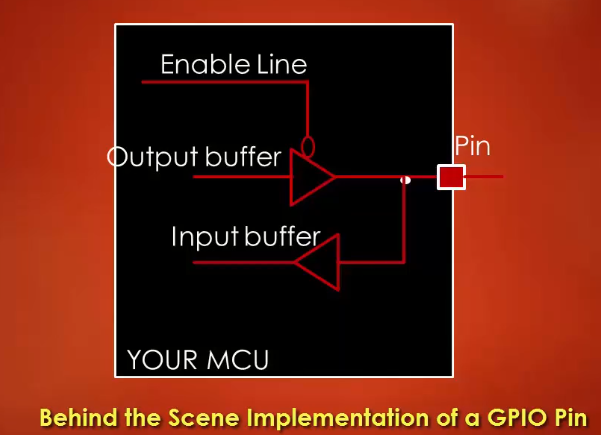
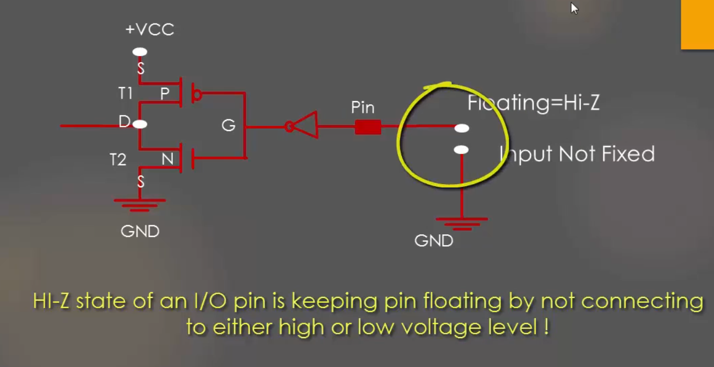
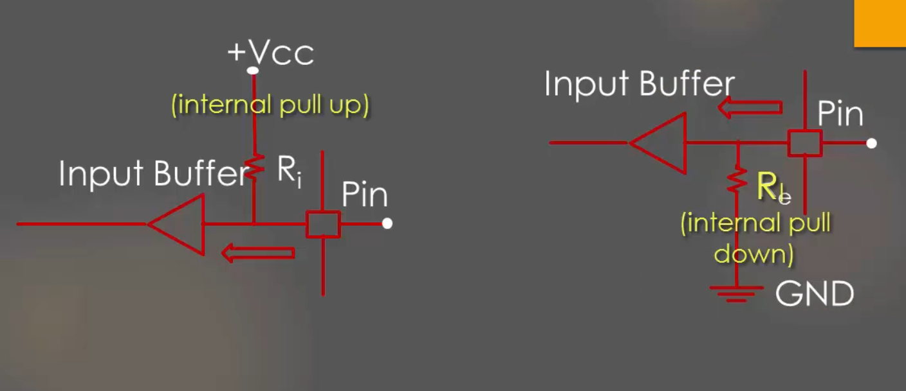
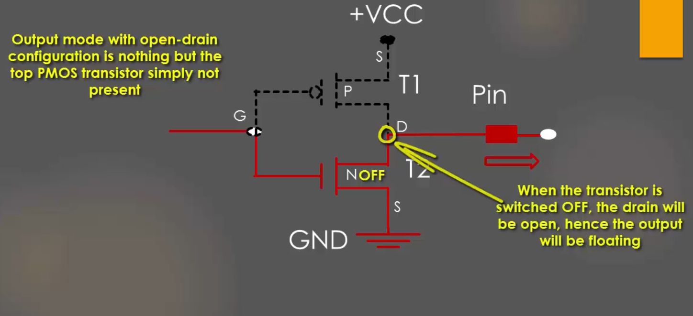
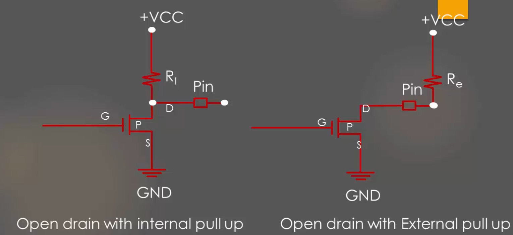
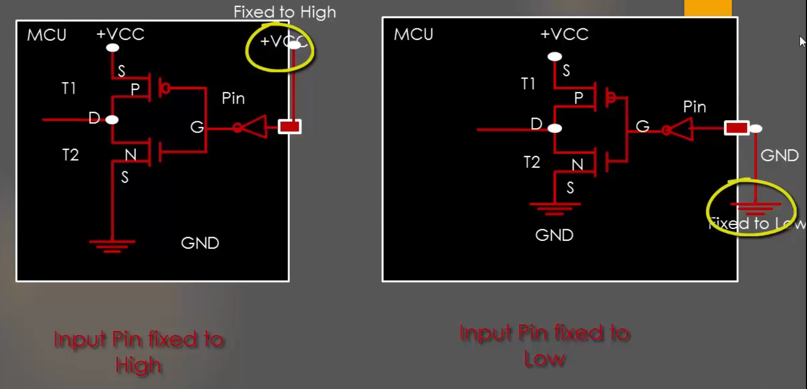
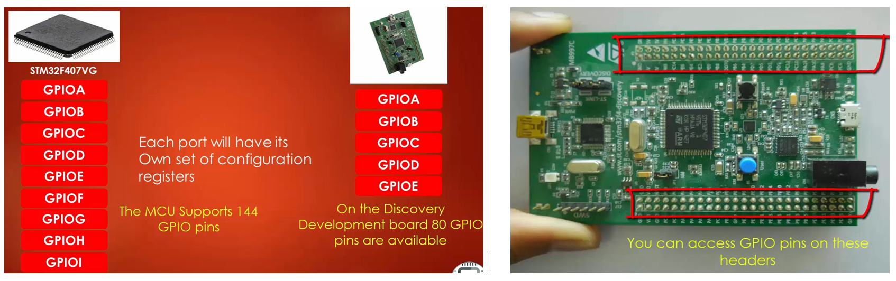
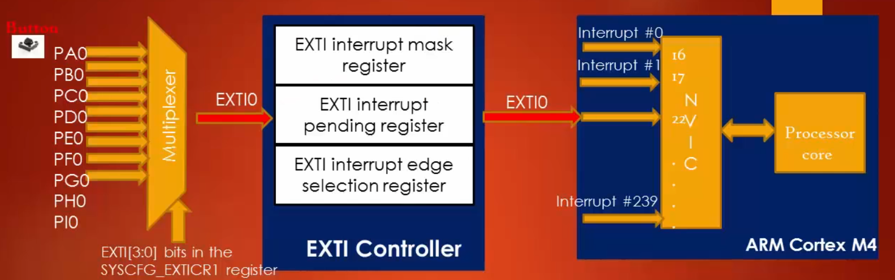
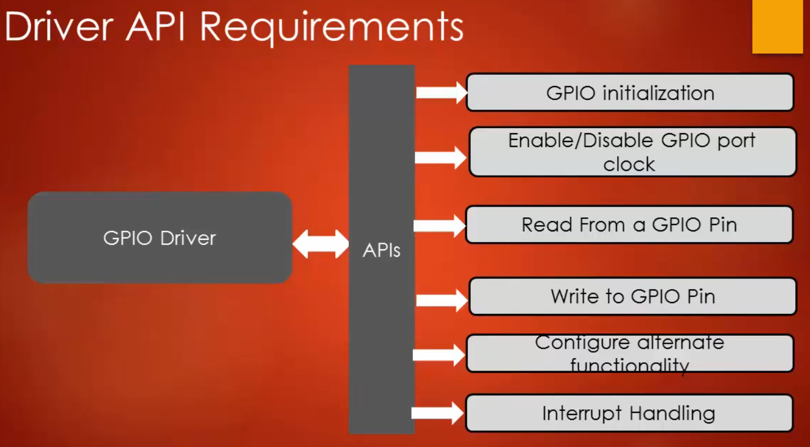

## GPIO(General Purpose Input/Output)
Before we start with GPIO in our MCU, it is necessary to know about the basic concepts related to GPIO. These concepts are generic and can be applied to any MCU. The GPIO port is a collection of a fixed number of input/output pins. Let us explore how GPIO pins work in MCU in a very simple way. Below figure shows the behind the scene implementation of GPIOs in MCU.

As shown in the above figure, it has one input buffer and one output buffer along with the enabling line. When the enable line is 0, the output buffer gets activated and the input buffer is OFF. When enable is 1, the input buffer is ON and the output buffer is OFF. Buffer is nothing but two CMOS transistor connected as shown below.

**Output Buffer**: When you write 1 on this buffer, due to the inverter logic 0 is given as input to two transistors and hence T1 will be activated and T2 will be deactivated. Hence pin will be pulled to high. When you write 0 to this buffer, due to the inverter logic 1 is given as input to two transistors and hence T1 will be deactivated and T2 will be activated. Hence pin will be pulled to ground(low). This is how the output buffer of GPIO works.

**Input buffer**: We can observe here that the input buffer is simply the rotation of output buffer in 180 degrees. When the pin is driven high, T1 will be ON and  T2 will be OFF hence you will read High. When the pin is driven low, T1 will be OFF and T2 will be ON hence you will read Low.

This is how the input and output mode of a GPIO pin works behind the scene with its respective buffers and enable line. This enable line is usually configured by a  GPIO control register which will be discussed later.

### GPIO Input Mode with High Impedance State
High Impedance is also called a HIGH-Z state. HIGH-Z state of an I/O pin is nothing but keeping the pin in **Floating State** i.e, neither connected to High nor connected to low voltage level as shown below.

When a microcontroller power-ups, by default all the GPIO pins will be in Input-Mode with HIGH-Z state or floating state. This applies to almost all the MCU. Keeping the pin in the Floating state can lead to leakage current which may lead to higher power consumption. This is because pin in a floating state is highly susceptible to picking up the circuit noise voltage and results in leakage current.

### GPIO Input Mode with Pull-Up/Pull-Down Configuration
Floating state of the pin can be avoided by simple internal pull-up or pull-down resistors as shown in the below figure.

There is Configuration register for every GPIO port which enables you to handle these internal pull-up/pull-down registers. It is always safe to keep the unused GPIO pins in one of these states so that they are reluctant to voltage fluctuations which may lead to leakage of current.

### GPIO Output Mode with Open Drain Configuration
The Output Mode with open-drain configuration is nothing but the top PMOS transistor simply not present as shown below.

So we have a single NMOS transistor(T2) when T2 is ON the output is pulled to low. When T2 is OFF, the drain of the transistor is in floating/open state. This is the reason it is called open-drain. Hence GPIO output mode with open-drain configuration has only pull-down capability not the pull-up. So there are two states available in this configuration **Pull-Down** and **Float**. The floating state is useless. Opend drain output configuration is useless until you provide pull-up capability either by internal pull-up transistor or external pull-up transistor. That leads to the next topic which is open-drain with internal and external pull-ups.

### GPIO Output Mode - Open Drain with Pull-Up

Above figure shows the GPIO Output mode in Open drain with internal and external pull-up configuration. So to use of open-drain configuration in real-world application it has to be used along with either internal/external pull-up resistor. These days all MCU supports internal pull-up, which can be activated/deactivated using GPIO Configuration Registers.

### GPIO Output Mode with Push-Pull Configuration
When the GPIO pins are configured as input, the default state is HIGH-Z state. But when GPIO pin is configured as Output, then by default it will be in Push-Pull Configuration as shown in the below figure.

This output configuration is called Push-Pull because the output will be pulled actively High and Low by using the two-transistors. In the push-pull configuration, there is no need for any pull-up/pull-down resistor. This configuration has two transistors. The Top transistor(PMOS) will be ON when output has to be driven HIGH. The bottom transistor(NMOS) will be ON when the output should be driven to LOW.

### Optimizing I/O Power Consumption
As discussed earlier, we know that if the pin is in the floating state then it leads to leakage current from VCC to GND(Ground). Let us consider the case where the input pin is not in the floating state,  that is it is connected to either a fixed HIGH or LOW voltage level as shown in the below figure.

Referring  from the above figure, when the pin is fixed to HIGH voltage, due to the inverter logic input to buffer will be 0, the transistor T1 is ON and T2 is OFF and hence there is no path for the current to reach the ground, in this case, leakage will not happen as current never leaks out from +VCC to Ground. When the pin is fixed to LOW, T1 is OFF and T2 is ON, in this case also current will not leak as there is no path from VCC to Ground. Let us Now Consider the floating state as shown below.

In this case, the pin input voltage is not fixed, due to the circuit noise the input voltage to pin may toggle between (70 to 50)% of VCC to 30% of VCC. That is the voltage on the pin will be in the intermediate
region as shown in the above figure, this turns on both the transistors hence a small amount of current sinks to ground as shown. But all the modern MCUs I/O pins use Schmitt trigger to combat the noise issue.
    
## GPIO Register Structure

Each GPIO port is governed by many registers as shown above. These registers may vary depending on the vendors who manufacture it. Generally in MCU GPIO port is governed by these registers. The Minimum set of registers you find in any MCU for GPIO port
includes:

* **Port Direction (Mode) Register**: using which you can set the IO modes such as input, Output, Analog, etc.
* **Port Input Data register**: Used to read from GPIO port.
* **Port Output Data Regitser**: Used to write to a GPIO Port.

In STM32F4xx series of microcontrollers, each GPIO port is governed by many configuration registers. You can find more about all different GPIO registers in **Section 8.4 GPIO Register(Page 281 in STM32F4xxx Reference Manual (RM0090))**. From STM32F407VGT6 block diagram we can see that all the GPIO ports are conected to Cortex-M4 processor via AHB1 Bus. AHB1 bus is the main system bus which can be operated at a maximum speed of 168Mhz.
                                                                                        
### GPIO Ports and Pins of STM32F4xx
The STM32F407VGT6 Microcontroller supports 9 GPIO ports(i.e, GPIOA to GPIOI). Each GPIO port is a group of 16 GPIO pins and each port has its own set of configuration registers. The MCU supports total 114 GPIO pins, but on the development board the manufacture brought out  5 ports (i.e, GPIOA to GPIOE). So Totally 80 Pins are available as shown below.

## GPIO Regitsers 
**(Refer : Section 8.4 GPIO Regitser (Page 281 in STM32F4xxx Reference Manual (RM0090))**

### 1. GPIO port mode register (GPIOx_MODER) (x = A..I/J/K)
This register is used to configure the mode of a particular GPIO pin. Before using any GPIO port we should decide its mode that is whether you want to use it as input, output, alternate functionality or analog mode.

**MODERy[1:0]**: Port x configuration bits (y = 0..15), these bits are written by software to configure the I/O direction mode.

- 00: Input (reset state) -> By default.
- 01: General purpose output mode
- 10: Alternate function mode -> Such as UART, SPI, I2C ect.
- 11: Analog mode

### 2. GPIO port output speed register (GPIOx_OSPEEDR)** (x = A..I/J/K)
When the GPIO pin is in the output mode, this register is used to choose the output type. 

**OTy[15:0]**: Port x configuration bits (y = 0..15), These bits are written by software to configure the output type of the I/O port.

- 0: Output push-pull (reset state)
- 1: Output open-drain

### 3. GPIO port output speed register (GPIOx_OSPEEDR) (x = A..I/J/K)
This is register is used to configure the speed of the GPIO pins.

**OSPEEDRy[1:0]**: Port x configuration bits (y = 0..15), these bits are written by software to configure the I/O output speed.

- 00: Low speed
- 01: Medium speed
- 10: High speed
- 11: Very high speed

**Note**

1. LOW-speed GPIO consumes less power as compared to HIGH-Speed GPIO.
2. But low-speed GPIO have larger (Trise ->rising edge) and (Tfall->falling edge) which we call Slew Rate when the speed is low rise and fall of GPIO is not quick enough which may not be suitable for some applications.
3. Reference manual of this MCU claims that pins fastest toggle speed is every two clock cycle. That means if the GPIO is High and it wants to go low then it needs minimum two processor clock cycle. Let's say if MCU is running at 48Mhz then the fastest toggle speed is 24Mhz.

### 4. GPIO port pull-up/pull-down register (GPIOx_PUPDR) (x = A..I/J/K)
This register is used to configure internal pull-up/pull-down register on each I/O pin. Internal pull-up/pull-down registers can be configured in the GPIO pin which is in input or output mode. 

Bits 2y:2y+1 **PUPDRy[1:0]**: Port x configuration bits (y = 0..15), these bits are written by software to configure the I/O pull-up or pull-down.

- 00: No pull-up, pull-down
- 01: Pull-up
- 10: Pull-down
- 11: Reserved 

### 5. GPIO port input data register (GPIOx_IDR) (x = A..I/J/K)
It is a 32-bit read-only register in which only the lower 16-bits are used and upper 16-bits are not used. Each bit represents the input voltage level of the I/O pin belonging to the particular GPIO port. For example, if the value of bit-6 of the GPIOC_IDR register is 0, then the input voltage of the 6th IO pin of the Port C is 0V. Which indicates that voltage on PC6 is 0V. If bit-8 of the GPIOC_IDR register is 1 input voltage of the 8th IO pin of the Port C(PC8) is 3.3V. Reading this register gives voltage on each pin of a GPIO Port.

### 6. GPIO port output data register (GPIOx_ODR) (x = A..I/J/K)
This is also a 32-bit write-only register in which only the lower 16-bits are used and upper 16-bits are not used. In this register, each bit position is used to write an output value for a corresponding pin of the port. For example, if you want to drive PC8 to  +VDD(3.3V), then write 1 to the corresponding bit position i.e, 8th bit of the GPIOC_ODR register. Similarly, if you want to drive  PC6 to GND(0V) then write 0 to the corresponding bit position i.e, 6th bit of the GPIOC_ODR register.

### 7. GPIO Alternate Function Register
This is one of the important GPIO configuration registers. This register is used to configure the alternate functionality of the particular pin of GPIO Port. In this MCU there are two alternate function registers.

1. **GPIO alternate function low register (GPIOx_AFRL) (x = A..I/J/K)** -> Used for Pin 0 to 7.
2. **GPIO alternate function high register (GPIOx_AFRH) (x = A..I/J)**  -> Used for Pin 8 to 15.

Each GPIO Pin supports 16(AF0 to AF15) Different alternate functions. This means that each GPIO pin can be configured into one among the 16 different alternate functions. Since there are 16 possible alternate functions for each pin, 4-bits are needed to configure each GPIO pin. So Alternate function low register is used for Pin 0 to Pin 7, whereas Alternate function high register is used for Pin 8 to Pin 15. To know about all the 16 different alternate functions -> Refer **Figure 26. Selecting an alternate function on STM32F405xx/07xx and STM32F415xx/17xx(Page 272 of RM0090).**

### 8. RCC AHB1 peripheral clock register (RCC_AHB1ENR)
To be able to work with any peripheral in an MCU first, you have to make sure that its peripheral clock(**fpclk**) is enabled. In STM32F4xx MCU, all the peripheral clocks are managed by RCC(Reset and Clock control) Block. GPIO port is also a peripheral and it is connected to AHB1 bus. The peripheral clock of GPIO port is derived from AHB1 bus clock. By default, all peripheral clocks are disabled to saving power, so it is important to enabling the clock before configuring or using any peripheral. The **RCC AHB1 peripheral clock enable register (RCC_AHB1ENR)** is used for this, as the name indicate this register is used to **enable/disable the clock for the peripherals** which are connected to AHB1 bus. For more details Refer **6.3.10 RCC AHB1 peripheral clock register (RCC_AHB1ENR)(Page 180 of RM0090).**
## GPIO Interrupt Handling
First, let us understand how peripherals such as GPIO interrupts the processor. External interrupts are generated by the peripherals such as GPIO, SPI, I2C, Timers, ADC, etc. Out of these external peripherals, some are directly connected to the processor via **NVIC**, and some interrupts are connected through **EXTI(External Interrupt Control Block)** as shown below.

From the above figure, we can see that peripherals such as I2C, SPI, USART, DMA, USB, etc are connected directly to NVIC, these are called **NVIC lines** through which peripherals issue interrupts directly to the processor. The NVIC Block of processor supports up to 255 exceptions, out of which 15 are internal system exceptions and 240 are external exceptions which are also called as external interrupts. Hence **exception number 16** is also called as **external interrupt 0**, **exception number 17** is also called as **external interrupt 1**. So there are 240 interrupt lines on which different peripherals can issue the interrupts. For example, SPI may issue the interrupt on **NVIC line 16**, then we say that **SPI IRQ number is 16** as it interrupts the processor at NVIC line 16.

Referring to the **MCU Interrupt Design** section we can see how GPIO pins deliver interrupts via EXTI lines (**Figure 41. External interrupt/event controller block diagram (Page 380 of RM0090)**). Below figure gives a better understanding of how GPIO will  deliver the interrupts to the processor.

Referring to the above figure, the interrupt generated on **PA0 pin** by **button push** will deliver the interrupt via **EXTI0 line**. This is how STM32Fxx based MCU will deliver the interrupt to the processor via NVIC. Since there is a multiplexer only one among these IO pins can interrupt the processor at any given time depending upon the value of EXTI[3:0] bits. So, GPIOs and some wake-up events from peripherals like RTC, USB, etc will interrupt the processor via EXTI controller block, rest of the peripherals like SPI, Timers, USART, I2C, etc will interrupt the processor directly via NVIC.

## GPIO Driver Development
### Overview of GPIO driver 

The above figure gives an abstract idea about the GPIO driver development. The sample applications (such as blinking an LED connected to GPIO pin) will use the **GPIO driver** along with the MCU specific **startup code** to interact with the GPIO pins. The same approach can be used to develop a driver for GPIO of different MCU with slight modifications.

### GPIO Driver API Requirements

The driver code will provide the APIs to do GPIO initialization such as configure the mode, output type, speed, etc and APIs or Macros to Enable/Disables the GPIO clock, Read from GPIO pin, Write to GPIO pin and Alternate functionality configuration such as SPI, I2C, and UART, etc. Also, an API to handle Interrupts.

### GPIO Driver Code/Files
The two main files for the GPIO driver are **_hal_gpio_driver.h_** and **_hal_gpio_driver.c_**. The header file(**.h** file) contains 3 main sections: 
1. GPIO Register bit definitions and macros
2. Data structure for GPIO Pin Initialization
3. Declaration of all Driver Exposed APIs.

The source file (**.c** file) provides the function definition of all the APIs. You can find the sample LED driver to drive the on-chip user LED, which uses GPIO driver files for its imlementation. Ref: **_led.h_** and **_led.c_**. You can find some sample application in the folder **STM32F407 Sample Applications**. 

