# I2C(Inter-Integrated Circuit)
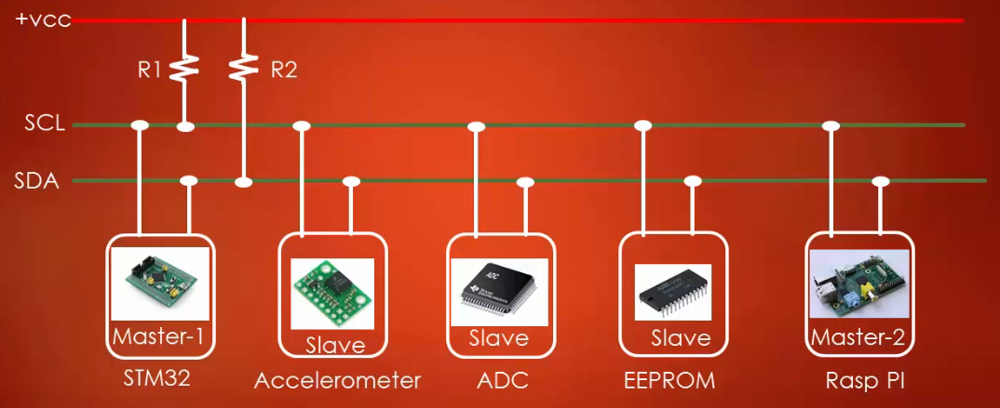

The **I2C** protocol, pronounced as an "I squared" or "I two C" is a **two-wire** serial bus protocol developed by Philips Semiconductor in 1982. Currently, I2C is widely used in interconnection of single-chip Microcontroller, Memory chips, ADC, DAC, Pressure/Temperature sensors as well as other low-speed peripherals. The I2C protocol requires  2 lines for data communication, they are **SDA(Serial Data Line)** and **SCA(Serial Clock Line)**. Each slave is identified with a **7-bit/10-bit** address, the master must know these addresses to communicate with the slave. Another interesting fact about I2C is that slave at any time become master and master can become a slave (if they incorporate the necessary hardware). The I2C is half-duplex and can transfer data up to 2 to 3Mhz.

## I2C Hardware Setup
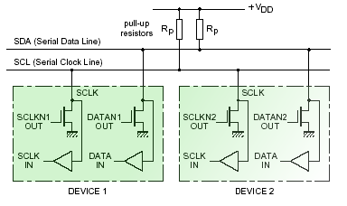

The above figure shows the hardware setup of the I2C. Here both the pin **SDA** and **SCA** are in **open-drain** configuration. But the open-drain configuration is useless unless we provide a **pull-up/pull-down** resistor (To know more Click **[Here](https://github.com/SharathN25/STM32F407-Discovery/tree/master/GPIO_Driver#gpio-output-mode-with-open-drain-configuration)**).
In this case, it is pulled up using **pull-up resistor**, whose value may range between 4 to 10K Ohm. There is a formula to calculate these resistor's values based on factors like speed, etc. However, the programmer can activate the internal pull-up transistor of the IO pin instead of using the external transistor.

## I2C Basic Operation
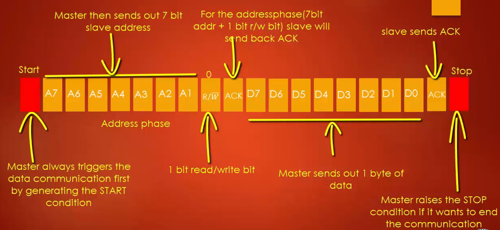

* Master always triggers the data communication first by generating the **START** Condition. At this point, the bus is under the control of the Master.
* Now the Master sends out a **7-Bit Slave address** along with the **one Read/Write Bit**. This is called the **address phase**. If **R/W = 1**, the master wants to read data.  If **R/W = 0**, then the master wants to write data.
* Here let us assume that R/W =0 (i.e master wants to write data). When the address phase finishes, the slave will send **ACK**(Acknowledgement) back if its address matches
with the address sent out by the master. 
* After Receiving the ACK, the master will send the data byte and for each byte slave receives, the slave will send back ACK.
* After this at any point if the master wants to stop communication it will raise the **STOP** condition, where the bus will be released.
### START Condition
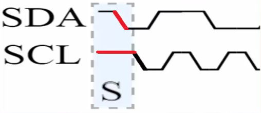

If teh **SDA** line goes ***LOW*** when the Clock is ***HIGH*** then it is interpreted as **START Condition**.

### Address Phase
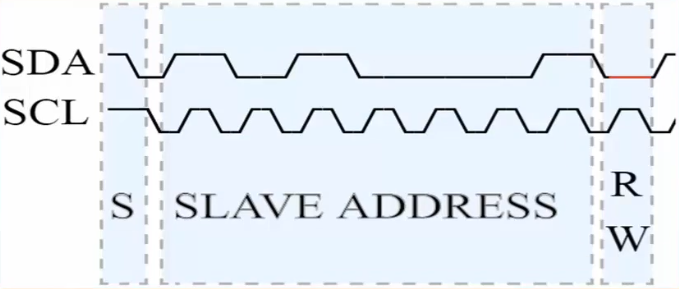

Afte the **START** bit, the **Address Phase** comes as discussed before.  During the address phase the **SDA** will make the transition when the clock is low.  After 7 Clock-Cycle the address is sent and at 8th Clock-Cycle master sends out R/W bit. At the 8th Clock-Cycle if SDA is high then the master wants to read and if SDA  is low then the master wants to write. This is how the address phase works in accordance with the clock.

### ACK and NACK
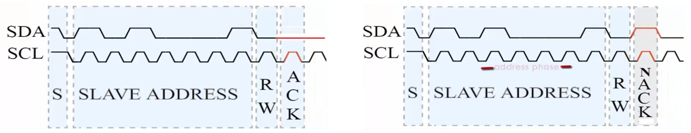

When the master sends a 7-Bit address, if it matches the slave address then the slave will pull the SDA to low at 9th Clock-Cycle.
If **SDA** is ***LOW*** at the 9th Clock-Cycle then it is interpreted as **ACK**. If **SDA** is ***HIGH*** at the 9th Clock-Cycle then
it is interpreted as **NACK**.

### STOP Condition
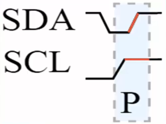

When the Clock is ***HIGH***, if the **SDA** makes ***LOW to HIGH*** transition, then it is interpreted as **STOP** Condition.

##   I2C Clock Stretching
* Clock stretching is one of the most powerful features of I2C protocol which is used to slow down the communication. Clock Stretching simply means that holding the clock to ***Low*** Level (Ground Level).
* The Moment the clock is held low, the entire I2C interface pauses until the clock is given back to normal condition.
* In I2C Master determines the clock speed. There are situations where I2C-Slave is unable to cooperate with clock speed given by the master and needs to slow down. In such cases, the slave takes the advantage of **Clock Stretching** to slow down by pulling the clock to ***Low*** level.

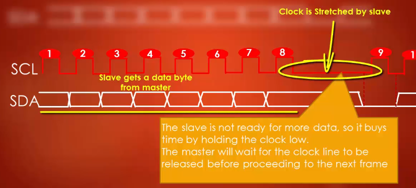

 * Referring to the above figure, at the 8th Clock-Cycle it stretches the clock as it is busy. And at the 9th clock, it sends ACK. If Clock stretching is not enabled then the Master would have interpreted the High(NACK) at the 9th clock Cycle(i.e immediately after the 8th clock cycle).
* I2C hardware automatically does clock stretching, the programmer just needs to enable this feature.

## I2C Operating Modes
### 1. Fast Mode
The Fast Mode is an operating mode in I2C protocol in which the device can transmit and receive data up to **400Kbps**. The Fast Mode devices are **downward-compatible** and hence it can
communicate with **Standard Mode** devices in **0 to 100Kbps** speed I2C bus system. The STM32F407 MCU supports only Fast mode and standard mode. Some devices support Fast Mode+.
### 2. Standard Mode
In standard mode, the data transfer can reach speed up to **100Kbps**. The standard mode devices are not upward-compatible.

## I2C Duty Cycle
Most of the modern MCUs will allow varying the duty cycle of the I2C Clock. The Duty Cycle is significant and different I2C modes have a slightly different duty cycle.

**Refer: Page 48 of UM10204 I2C-bus specification and user manual**

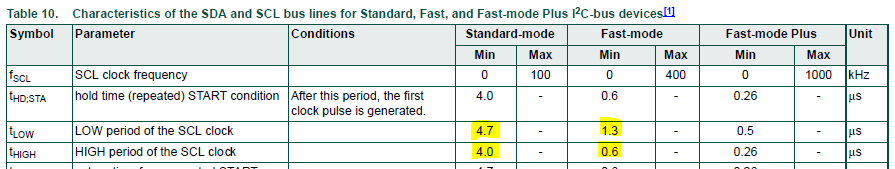

From the I2C specification we can see that for **Standard Mode** minimum values are ***tLOW = 4.7us** and ***tHIGH = 4.0us***. So to achieve 100KHz in standard mode we can keep ***tLOW = tHIGH = 5us*** (Which will pass the I2C specification). And for the **Fast Mode** minimum values are ***tLOW = 1.3us** and ***tHIGH = 0.6us***.

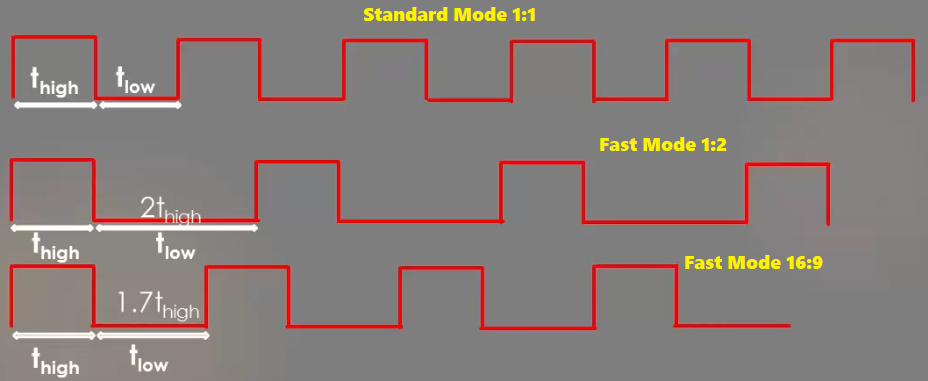

In STM32F4xx MCUs there is two option for Fast Mode, one is FM(1:2) and FM(16:9) as shown above. 

## I2C Addressing Modes
There are two Addressing Modes in I2C :

1. 7-Bit Addressing Mode
2. 10-Bit Addressing Mode

Nowadays almost all the MCUs support both the addressing modes.

### 7-Bit Addressing Mode
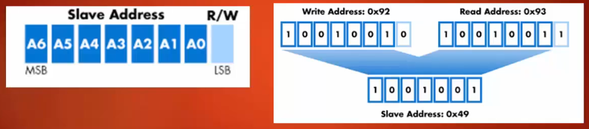

Here each slave is identified with **7-bit address**. As shown above, the  7-bit slave address when combined with **r/w bit *
becomes an **8-bit write address** or **8-bit read address**.

### 10-Bit Addressing Mode
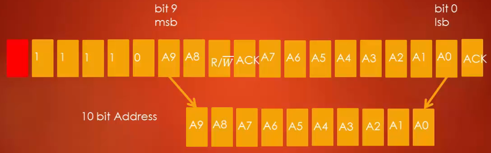

* To prevent the address clashes of the limited range of 7-bit address a new scheme of 10-bit addressing is used. 
* After the start bit, a leading **11110** pattern introduces a 10-bit addressing scheme.
* When the slave detects this bit pattern it understands that the master is using 10-bit addressing mode, and hence 7-bit address should not be included in this bit pattern. Ths slaves who use 7-bit addressing mode will ignore this phase.
* As shown in the above figure, the first byte contains the last two bits of the 10-bit address(i.e A9 and A8)
* The Second byte contains the remaining 8-bits of 10bit-address.

## I2C Functional Block Diagram
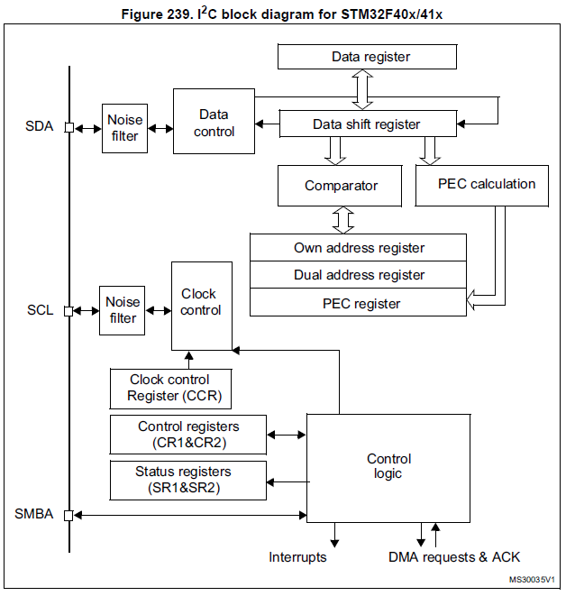

From the above figure,  we can see that 3 pins that are coming out are **SDA**, **SCL** and **SMBA**. The SMBA is used in SMB(System management bus) Protocol, which is almost identical to the I2C bus. Initially, Philips developed I2C, years later Intel came up with SMB which is an extension of I2C. From the functional block we can see there is one **Shift Register** and one associated **Data Register**(In case of SPI there were two buffer TX and Rx since SPI was full-duplex). Since I2C  is half-duplex one data register is sufficient. Also, there are **Address Registers** along with **Comparator**. Address comparison is done in the comparator during the address phase. There are two **Control Registers(CR1 and CR2)** and two **Status Registers(SR1&SR2)**. There is a **Clock Control Register(CCR)**,  which controls the serial clock coming out of the Pin SCL.

### I2C Peripheral Clock and Serial line Clock

STM32F407 MCU has three I2C Peripherals, all three I2C peripherals are connected to APB1(Max 42Mhz) System Bus. Referring to the above figure, the APB1 bus clock is given to multiplexer which is handled by the **control bits** of the Control register. The minimum value of these control bus is **2**, 0 and 1 is not allowed in this case, this is the design of STM.  So the minimum **Peripheral Clock Frequency(fpclk)** which can be supplied is **2Mhz** and Maximum is **42Mhz**. By using this **fplck**, the I2C clock circuitry generates I2C serial  Clock. This MCU can produce up to **400Khz** if it is in **Fast Mode** and **100Khz** in the **standard Mode**.

**Note:**
1. The **fpclk(Peripheral clock frequency)** must be at least **2Mhz** to achieve Standard mode I2C frequencies that are up to **100Khz**.
2. The **fpclk** must be at least **4Mhz** to achieve Fast Mode I2C frequencies that are above **100Khz** and below **400Khz**. 
3. The **fpclk**  must be in multiples of **10Mhz** to reach max **400khz** in FM I2C frequency.

## I2C IRQs and Interrupt Mapping
The below figure shows how I2C interrupts are delivered to the processor. The I2C peripheral produces two interrupts lines one for **I2C Events** and another is for **I2C Errors**.

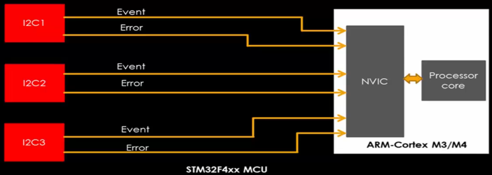

**Refer Section 27.4 I2C interrupts(Page 858 of RM0090)**

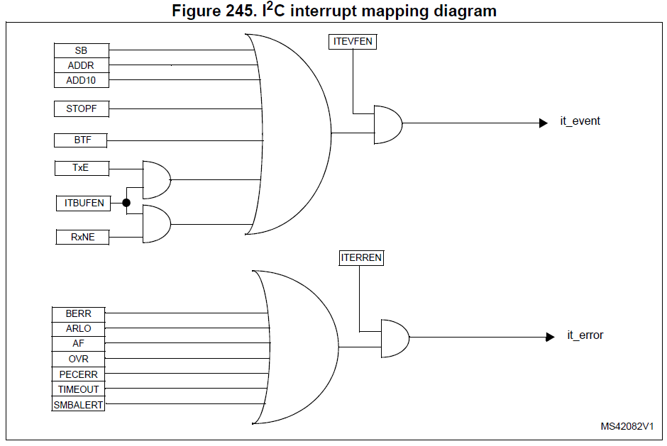

From the above figure 245, we can see that I2C peripheral is capable of producing two interrupt lines , **it_event** and **it_error**, these two lines goes to the **NVIC** block of  the processor. Unlike SPI, I2C has seperate line interrupting processor for errors.

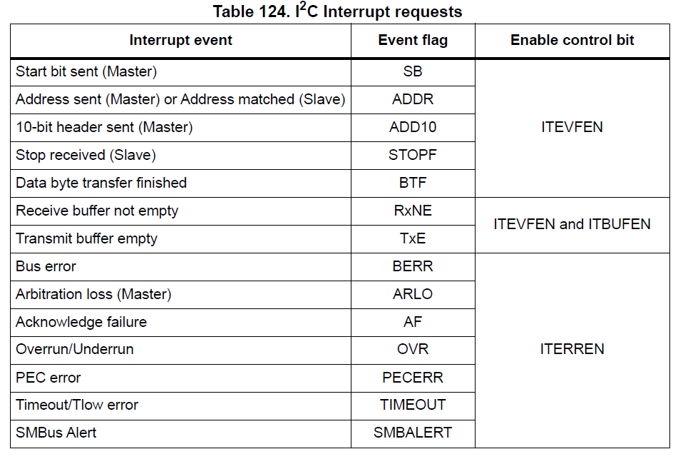

Table 123,describes Various I2C Events and Errors.

### I2C Specific Errors
* **Bus Error**: This error happens when interface detects an SDA rising or falling edge while SCL is high, occurring in a nonvalid position during the byte transfer.
* **Arbitration Loss Error**: This error happens when the interface loses the arbitration of the bus to another master.
* **ACK failure error**: happens when no ACK is returned for the byte sent.
* **Overrun Error**: Happens during the reception, when a new byte is received and data register has not been read yet and a new byte is lost. Whenever this error happens, surely, at least one byte is lost.
* **Under-run error**: This happens in TX when a new byte has to be sent and the data register has not been written yet and the same byte is sent twice. Clock stretching can be used to prevent Overrun and Under-run error. 
* **PEC error**: Happens when there is CRC mismatch if the CRC feature is enabled. 
* **Time out error**: Happens when master/slave stretches the clock by holding it low more than the recommended amount of time.

### I2C IRQ numbers
Referring to the **[Vector Table](https://github.com/SharathN25/STM32F407-Discovery#vector-table)** of the MCU, the I2C IRQ numbers are as fallows: 

* **I2C1_EV**(Event interrupt)--> Connected to **31st** line of NVIC.             
* **I2C1_ER**(Error interrupt)--> Connected to **32nd** line of NVIC.    
* **I2C2_EV**(Event interrupt)--> Connected to **33rd** line of NVIC.
* **I2C2_ER**(Error interrupt)--> Connected to **34th** line of NVIC.         
* **I2C3_ER**(Event interrupt)--> Connected to **72nd** line of NVIC.                 
* **I2C3_ER**(Error interrupt)--> Connected to **73rd** line of NVIC.

## I2C Registers
**Refer Section 27.6 I2C registers (Page 860 of RM0090)**
### 1. I2C Control register 1 (I2C_CR1)
* **PE(0th bit)** - Enables(1) the I2C peripheral. It is always recommended to make this bit 1 after all other initialization is done.
* **NOSTRETCH(7th bit)**  - this field is 0 by default, which means "Clock stretching" is enabled by default. This bit is used to disable clock stretching in slave mode when ADDR or BTF flag is set, until it is reset by software. If the 7th bit is **0 the Clock stretching enabled** and if its **1 then Clock stretching disabled**.
* **START(8th bit)** - When master makes this bit 1, start condition is generated. If you set this bit to 1 being in SLAVE mode, the device will automatically become master generating start condition. So the slave becomes master. (if the device is in slave mode and wants to master then it has to set this bit 1).
* **STOP(9th bit)** - Used to generate STOP condition.  
* **ACK(10th Bit)** - Used to enable the hardware ACK feature of I2C peripheral. As ACK plays a very important role it is necessary to make this bit set to 1 which sends ACK for every byte transferred. If this bit is not set, NACK will be sent for the reception of bytes(applicable to both slave&master).
* **PEC(12th Bit)** - for packet error checking. **SWRST(15th bit)** - used to reset peripheral when an error occurs.

### 2. I2C Control register 2 (I2C_CR2)
* **Bits 5:0 FREQ[5:0]**:  Used to Select Peripheral clock frequency, The peripheral intrinsic maximum limit is 50Mhz.
  * 0b000000: Not allowed
  * 0b000001: Not allowed
  * 0b000010: 2 MHz
  * ...
  * ...
  * ...
  * 0b110010: 50 MHz
  * Higher than 0b100100: Not allowed
  
* **ITBUFEN**: Buffer interrupt enable, **ITEVTEN**: Event interrupt enable and **TERREN**: Error interrupt enable. Unless we make the above bits to 1, you won't get  I2C event/error/buffer interrupts.

### 3. I2C Address Registers
There are two I2C address registers to set the device address. That means every slave device can have 2 different addresses. 
#### I2C Own address register 1 (I2C_OAR1)
By using this register, you can mention both 7&10 bit addresses. If 7bit addressing is used then it should store in ADD[7:1]properly, in this case, ADD0(bit-0) is don't care and ADDMODE(bit-15) should be made 0 in 7bit addressing mode and it is made 1 for 10bit addressing.

#### I2C Own address register 2 (I2C_OAR2)
This register is used to set another address for the slave. It supports only 7-bit addressing mode.

### 4. I2C Data Register
The data register is used to transmit and receive data-byte over any serial protocol. In I2C there is only 8-bit data frame unlike 
SPI. Hence bit-8 to bit-15 are reserved fro this register.

* **Transmitter mode**: Byte transmission starts automatically when a byte is written in the DR register. A continuous transmit stream can be maintained if the next data to be transmitted is put in DR once the transmission is started (TxE=1). That is TxE=1 
is an indication to put the next data byte in DR.
                      
* **Receiver mode**: Received byte is copied into DR (RxNE=1). A continuous transmit stream can be maintained if DR is read before the next data byte is received (RxNE=1). So whenever RxNE interrupt is received it is clear that there is a data received 
which has to be read.

### 5. I2C Status register 1 (I2C_SR1)
* **SB(Bit 0): Start Bit** - valid only for master, if master successfully generates start condition, then this bit is set 1 by hardware.    
* **ADDR(bit 1):Address sent (master mode)/matched (slave mode)** - For Master, if ADDR =1, then address phase is completed. For slaves, if ADDR =1, the slave address is successfully matched. SB & ADDR are set by hardware but should be cleared by firmware.
* **BTF(Bit 2): Byte transfer finished** - This is a very important flag which makes sense only when clock stretching is enabled. 
  * During TX of data, if TXE =1 and shift register is also empty(that is both data and shift register are empty) then BTF=1, and I2C clock is stretched to low to prevent under-run.
  * During RX of data, if RXNE =1 and shift register is also full(that is both data and shift register are full) then BTF=1, and I2C clock is stretched to low to prevent overrun.
  * So for master/slave if BTF =1, then it's clear that i2c communication is momentarily paused until BTF is cleared by writing to/ reading from the data register.
                      
* **STOPF(Bit 4): Stop detection(slave mode)** - if this bit is 1 that means that slave has detected stop condition raised by the master. this is set by
  hardware and should be cleared by software.
                     
* **RxNE(Bit 6): Data register not empty (receivers)** - if this flag=1, then it means shift register has received new data byte and stored in the data register. So new data is waiting to be read from in the data register. This flag is not set during address phase This flag must be used during the reception, 
firmware has to poll for this or raise interrupt when this flag is set to read data from DR. RxNE flag will be automatically cleared when DR is read.
                    
* **TxE(Bit 7): Data register empty (transmitters)** - Use of this flag is a must during the data transmission. If TxE=1, then it means data register is empty and it is the right time to put data int DR for transmission. This flag is not set during the address phase. a write into DR automatically clears the TxE flag.

### 6. I2C Clock control register (I2C_CCR)
The first 12 bits i.e CCR[11:0] are used to program the CCR. The CCR is value is calculated based on the given formula which is specific to STM. **Refer Section 27.6.8 I2C Clock control register (I2C_CCR) (Page 870 of RM0090)** for more details.

## Steps to do data transmission and recption in I2C peripheral
### 1. Master Transmitting Data
**Case**: Consider transmission of 3 bytes for simplicity

1. The Master firmware generates START Condition.
2. Firmware has to wait until SB=1, to confirm that the START condition is successfully generated.
3. The master goes for the address phase where it writes addresses along with read/write bit=0.
4. Master wait here until ADDR=1, which confirms the address phase is completed. ADDR flag is set only after ACK is received from slave for address sent.
5. Master should clear above ADDR flag until the ADDR flag is not cleared I2C will be in a wait state by stretching clock to low.
6. Once AADR is cleared, I2C comes up from the wait state and TxE will be Set. (Here DR and SR are empty). Here 1st byte is loaded into DR  which is then loaded into SR. and DR goes empty again. The count is decremented. (Initially, count =3) , now Count =2
7. As DR goes empty again, TxE=1, here we write the 2nd Byte to DR. Count is decremented. now count =1.
8. When shift register finished transmission of byte1 it gets ACK from the slave. It starts sending byte2 and DR gets empty and TXE=1 and byte 3 is loaded into DR, the count is decremented, count =0.
9. Since count=0, all bytes have been written hence no TxE interrupt is required. So buffer interrupt is disabled.
10. When byte2 is transferred, TxE=1, but no interrupt is generated.
11. SR now gets loaded with 3rd Byte and gets ACK from the slave.
12. Now both SR and DR are empty, so BTF goes high and Clock is stretched.
13. When BTF=1, interrupt is generated where we can check count value and if it is 0, we generate STOP Condition.

### 2. Master receiving data from slave
#### Case 1: Receiving only 1 byte from slave.
1. Master firmware generates START Condition.
2. Firmware has to wait until SB=1, to confirm that the START condition is successfully generated.
3. The master goes for the address phase where it writes addresses along with read/write bit =1.
4. Master wait here until ADDR=1, which confirms the address phase is completed. ADDR flag is set only after ACK is received from slave for address sent. Master should clear above ADDR flag until the ADDR flag is not cleared I2C will be in a wait state by stretching clock to low. After clearing the ADDR bit, the I2C interface will enter into master receive mode. In receive mode, the I2C engine receives data over the SDA line into DR via SR.
5. But before clearing the ADDR bit, you have to disable ACK because after the 1st-byte reception master should send NACK to slave but not the ACK. Then configure STOP bit to generate stop condition(It won't generate STOP condition immediately since I2C is in wait state), Now clear the ADDR flag.
6. Once ADDR bit is cleared, I2C comes immediately out of the wait state and gets 1byte in the shift register. Since ACK is disabled already, NACK is sent to slave and data byte will be transferred to DR which triggers RXNE interrupt followed by a STOP condition. In RXNE interrupt you can read the byte sent

#### Case 2: Receiving 2 bytes from slave
1. When ADDR flag =1, Clock is stretched and I2C is in a wait state.
2. Now we disable ACK(ACK=0) and set The POS=1. **POS: Acknowledge/PEC Position (for data reception)**
   * POS =0: In this case, ACK(Bit 10) controls the Acknowledge/Not-Acknowledge of current byte received in the shift register.
   * POS =1: In this case, ACK(Bit 10) controls the Acknowledge/Not-Acknowledge of Next byte received in the shift register.
3. Before clearing the ADDR bit, make ACK=0 POS=1. Now Clear the ADDR flag. 
4. Once the ADDR flag is cleared, now data1 will be received in master SR from slave SR, and ACK is sent to slave even though ACK is made 0, this is because we made POS=1.
5. Content of Master SR will be moved to the DR and RxNE flag goes high indicating DR is not Empty.  Since ACK is sent to slave for Data1 reception, slave assumes that the master wants the next byte so it sends Data2. Since we made ACK=0 and POS=1, NACK will be sent to the slave.
6. Now in masters I2C engine both SR and DR are full, BTF flag is set and the clock is stretched to make the I2C wait state. So now all firmware has to do in BTF handler code is to read data1 and data2.
7. What exactly firmware does in the BTF handler is - first generate stop condition the read data register twice.

#### Case 3: Receiving more than 2 bytes (N>2) from slave.
1. Lets assume that there is a need to receive 100 bytes from the slave, N=100th byte, N-1=99th byte, and N-2=98th byte.
2. From 1st byte to 97th byte(i.e N-3 )  carry out the reception in a normal way, that is waiting for RxNE=1 then read from DR.
3. Once you reach till N-2 byte, follow below steps:-
   * First wait until BTF=1,(that is N-2 is in DR and N-1 is in SR and also both SR=DR=full). So the clock is stretched to low.
   * In BTF handler, first, disable ACK then read the data register.
   * Now N-1 is in DR and Nth Byte is in SR. Now again BTF=1.
   * Now in BTF handler configure stop condition then read the last two bytes.

### 3. Slave Transmitting Data
1. Master sends the address along with r/w = 1 if the address matches the slave sends ACK.
2. Now ADDR=1, since slave address is matched. and when ADDR is cleared slave fall into Tx mode.
3. Initially both DR and SR are empty so TxE goes high until slave writes any data into DR.
4. After this for every TxE interrupt slave sends one data byte and the master sends ACK.
5. When a master no longer wants any data from slave it sends out NACK.
6. When NACK is received it causes the ACK-failure interrupt in slave,  where slave assumes that it is an indication from master to end communication. Then the master will generate stop condition which makes stop flag to be set in slave.

