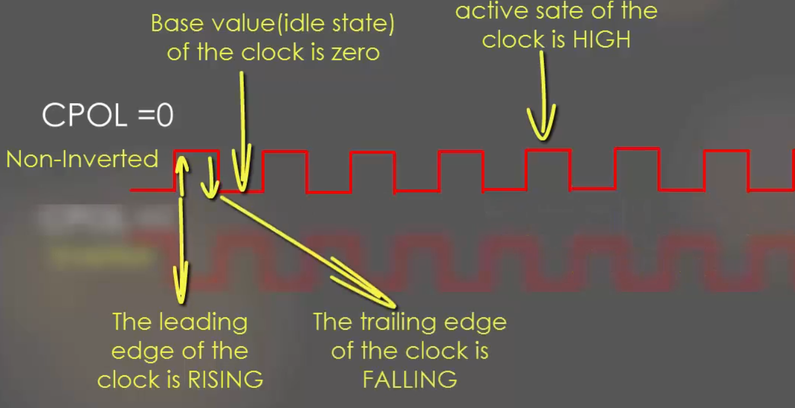
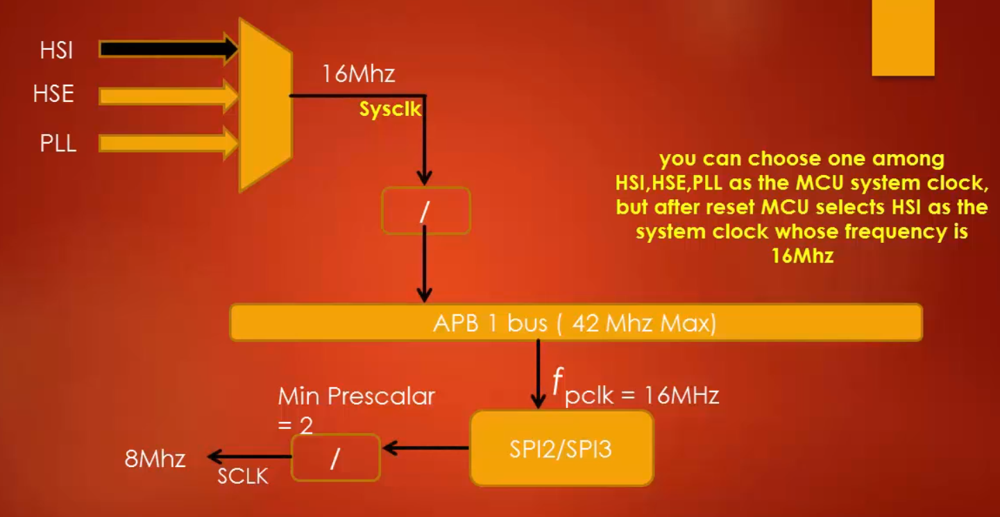
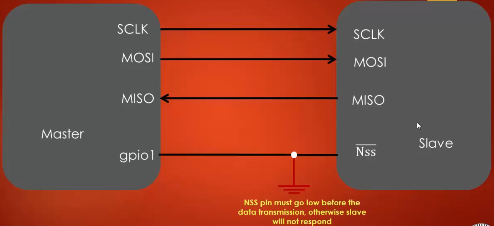
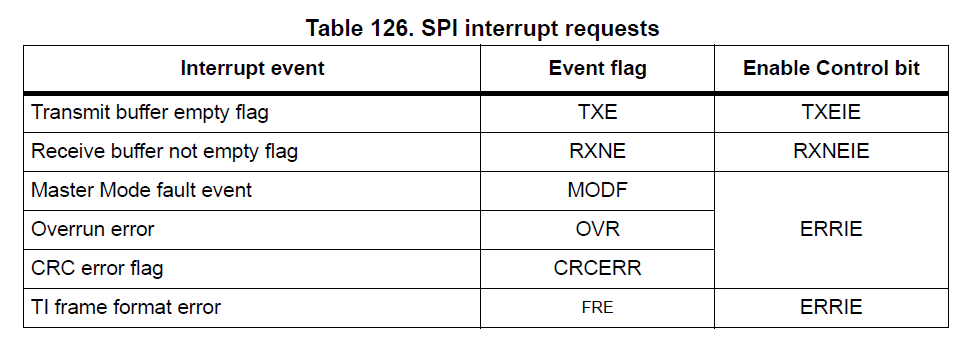
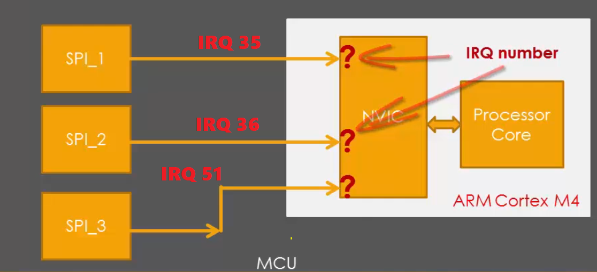
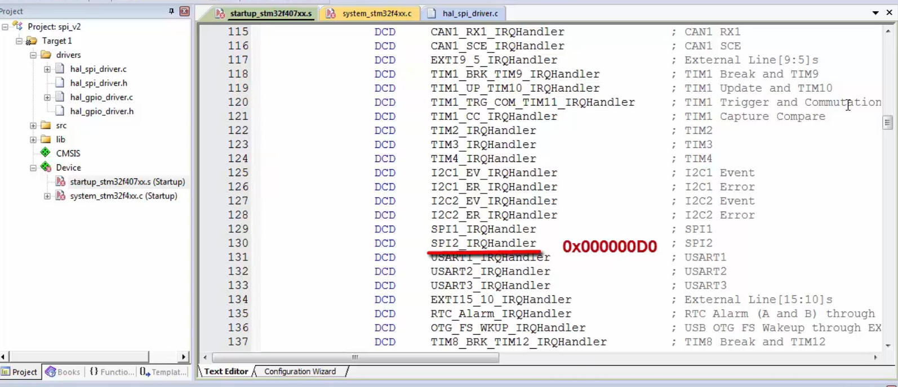

# Exploring STM32F407 Discovery Board
The main purpose of this project is to get an insight into the STM32F407 Discovery Board, which is an ARM Cortex M4 based Microcontroller. As I started working on STM32F07 Discovery Board, initially it was difficult and confusing to understand and program this microcontroller because understanding internal structures and working of the microcontroller using datasheet of STM32F407VGT MCU is difficult especially if one is a beginner.

                                      Figure 1 : STM32F407 Discovery Board

This project gives almost all the basic information needed to get started with STM32F407 Discovery Board and also development of driver code.

**Hardware Used** : STM32F4 DISCOVERY kit, for more information visit https://www.st.com/en/evaluation-tools/stm32f4discovery.html

**Software Tool** : Kiel MDK V5, for more information visit http://www2.keil.com/mdk5/.
                  For installation of Keil MDK V5, refer https://youtu.be/d_O2tu5CMbQ

**Note** : As this microcontroller has many advanced features and the main aim of this project is to get all basic insights, during the driver development only the required functionalities are added and other advanced functionality is not added. I may update the driver and other functionality in the future.

Please find the STM32F4 Discovery User Manual,STM32F4xxx Reference Manual (RM0090) and other related documents inside a folder called Documents. I will be referring to these documents for information such as block diagrams, register details ect.

## Overview of STM32F407VGT6 Microcontroller
**Please refer : Figure 6. STM32F407VGT6 block diagram from 'STM32F4 Discovery User Manual' (Page 12).**

The STM32F407 Discovery board uses STM32F407VGT6 Microcontroller which has **ARM Cortex-M4F** Processor, which is capable of running upto **168Mhz**. This MCU has many peripherals such as GPIO ports, TIMERS, ADCs, DACs, Flash Memory, SRAM, SPI, UART ect. The processor and peripherals talk via **BUS-Interface**.  There are three busses available :-
1. **I-BUS** (Instruction Bus)   
2. **D-BUS** (Data Bus)
3. **S-BUS** (System Bus)

**I-BUS**
This bus connects the Instruction bus of the Cortex®-M4 with FPUFloating point unit) core to the BusMatrix. This bus is used by the core to fetch instructions. The target of this bus is a memory containing code (internal Flash memory/SRAM or external memories through the FSMC/FMC).

**D-BUS**
This bus connects the databus of the Cortex®-M4 with FPU to the 64-Kbyte CCM data RAM to the BusMatrix. This bus is used by the core for literal load and debug access. The target of this bus is a memory containing code or data (internal Flash memory or external memories through the FSMC/FMC).

**S-BUS**
This bus connects the system bus of the Cortex®-M4 with FPU core to a BusMatrix. This bus is used to access data located in a peripheral or in SRAM. Instructions may also be fetched on this bus (less efficient than ICode). The targets of this bus are the internal SRAM1, SRAM2 and SRAM3, the AHB1 peripherals including the APB peripherals, the AHB2 peripherals and the external memories through the FSMC/FMC.

So instructions and data use I-bus and D-bus respectively, All the other peripheral uses System bus. The Cortex-M4 processor contains three external Advanced High-performance Bus (AHB)-Lite bus interface and one Advanced Peripheral Bus (APB) interface. The GPIOs are connected to AHB1 bus which has a maximum speed of 150Mhz and is divided into two buses as APB1 and APB2. APB1 runs at 42Mhz(max) and APB2 runs at 82Mhz(max). The different peripherals such as SPI, UART, TIMERs, ADCs, DACs, etc are connected to either APB1/APB2 buses. And the AHB2(168Mhz max) is connected to Camera and USB OTG interfaces, AHB3 is connected to External memory controller.

## Bus Matrix
**Please refer : Figure 7. System architecture from 'Using the STM32F2 and STM32F4 DMA controller(AN4031)' (page 18).**

Refering to the figure 7, The Yellow blocks are Master and blocks in Green are Slaves, there are lots of connected dots which actually says that there is path from master to slave for communication. In Microcontroller , the communication between the processors and the peripherals is seen in the scope of communication between master and slave. Here the processor ARM Cortex-M4 itself is a master, and it may have other masters such as Ethernet, High Speed USB 2.0, DMA1 and DMA2.

## Clock

STM32F407VGT6 Micorcontroller has 3 main clock sources:

1. **Crystal Oscillator(HSE)** - This is external clock source which can be connected to MCU based on requirements. HSE standas fro **High speed External**. If you want to use **HSE** as **system clock** an external crystal oscillator(whose frequency must be in range **4 to 6Mhz** ) has to be connected. In this board, the manufacturer has connected **8Mhz** crystal.

2. **RC Oscillator (HSI)** - All modern MCU comes with internal RC Oscillator, which can be just activated to use. HSI stands for **High Speed Internal** .After Reset, by default **HSI** is used to provide a clock to MCU, which means by default MCU select HSI as the clock. This clock is internal to MCU and its value is **16Mhz** in STM32F407 MCU. The HSI internal oscillator has the advantage of providing a clock at a low cost, as no external component is required to use this clock. It also has a faster start-up time than the external crystal oscillator however, frequency is less accurate when compared to the external crystal oscillator.

3. **PLL(Phase locked loop)** - It is also Implemented internally in MCU, it uses low frequency sources to generate high frequency clock (PLLCLK).The power of PLL lies in producing high-frequency clocks of various programmable range. By using PLL you can boost the **HCLK(AHB)** up to **168Mhz** in STM32F4xx MCU. All the modern MCU has PLL. If you want to use MCU-buses at their maximum speed then we have to use PLL only. You have to feed either HSI or HSE to the PLL as input frequency. Then by using all PLL circuitry settings, it produces a PLL output clock in the range of 100's of Mhz. So to Run STM32F407 at its maximum frequency(168Hhz) you have to use PLL. 
 
**Please refer : Figure 21. Clock tree from 'STM32F4xxx Reference Manual (RM0090)' (Page 216).**

**Note** : If your using **STM32 CUBE MX** tool, then select STM32F407 board and goto **clock configuration** for a much better clock tree representation.(I prefer to use this clock representation for easier understanding).

From above clock tree we can see that **HSI RC** is 16Mhz internal Clock, and an external oscillator (4Mhz to 26Mhz) has to be connected to **HSE** input and **PLL** takes HSI/HSE as input to produce various other clocks. All 3 of these clock sources are given to SYSTEM CLOCK MULTIPLEXER where we can select clock source, Output of this MUX is **SYSCLK**(i.e, System Clock).

- **SYSCLK** : This is the Main clock of MCU, using this other clocks are derived (Ex: Peripheral, Bus clocks ect). SYSCLK is given directly to Ethernet PTP Clock.
- **HCLK** : HCLK is derived from SYSCLK with a Prescaler in between , which brings down the clock frequency. HCLK goes directly to AHB bus, core, memory and DMA. HCLK goes to Cortex System Timer with prescalar in between and HCLK goes directly to Cortex Processor (FCLK Cortex Clock).
- **PCLK** : PCLK1 and PCLK2 are derived from HCLK, PCLK1 goes to APB1 peripheral clock and APB1 Timer Clock and PCLK2 goes to APB2 peripheral clock and APB2 Timer Clock.

By default MCU uses HSI (i.e internal RC Oscillator) as SYSCLK, Which means after reset HSI is used as SYSCLK Source. Before using any peripheral its clock should be enabled. Referring MUC Block Diagram, all different peripheral drives the clock from bus which it is connected. By default almost all the peripheral are deactive, which means there clocks are not enabled. **RCC**(Reset and clock Control) engine of MCU gives various registers to enable and disable various peripheral clocks. For more information refer RCC section of STM32F4xxx Reference Manual (RM0090), page-213.  

### Clocking the MCU using External Crystal Oscillator
As explained before, you can connect (4 to 26Mhz) crystal oscillator to MCU. In STM32 board manufacturer has connected 8Mhz Crystal. Even though it is connected its useless as its disabled. Before using an external oscillator, we need to enable it by using **RCC Clock Control Register(RCC_CR)**. Refer  **7.3.1 RCC clock control register (RCC_CR) (page 224 of RM0090)**.  Referring to the **RCC_CR** Register:

* Bit 17 and 16 are **HSERDY** and **HSE ON** respectively
* To enable HSE, HSEON bit is made 1, then you have to wait until the HSERDY flag becomes 1, which indicates the HSE oscillator is ready to use. It important to wait until HSERDY flag is set.
* Now HSE is ready but it is not yet set as **SYSCLK**(System Clock).

So to set HSE as System clock,  **RCC clock configuration register (RCC_CFGR)** is used.  Refer **7.3.3 RCC clock configuration register (RCC_CFGR)(page 228 of RM0090)**.  Referring RCC_CFGR, bit 0 and 1 are used to switch system clock. 

* If **Bit1:0 SW**  = 01, then HSE oscillator selected as the system clock .
* Once we do this HSE will be used as a system clock

## Vector Table
It is a table of Vectors. Generally, Vectors are related to directions. We know that **VECTORS** in physics has both magnitude and direction. In our context we can compare **pointers** and **direction**, as pointers will point to certain addresses. So we can say that Vector table is a table which holds the specific addresses. It contains the addresses of **Exception Handlers**. Here system exceptions(these are MCU internally generated) and Interrupts(Which are external) are collectively called as exceptions.

**Referring : Table 61. Vector table for STM32F405xx/07xx and STM32F415xx/17xx (Page 372 of RM0090)**

Above Vector table is not the complete table, it's just a part of it. Please refer the RM0090 for complete vector table. There are 6 columns in Vector Table: Position, Priority, Type of priority, Acronym, Description, and Address.
* **Position**: We can see that position is kept empty for all the system exceptions, system exceptions come from the processor end and vendor ST does not have control over system exceptions. These positions are with respect to **NVIC**(Nested vectored interrupt controller). For example, **Window Watchdog interrupt** is at **Position 0** w.r.t to NVIC. Another name for the position is IRQ Number.
* **Priority**: This column gives the priority of exceptions and interrupts. From the table, we can see that Reset has the highest priority of -3.
* **Type of Priority**: This column tells us that whether the priority of exceptions can be changed or not. Here Reset, NMI and Hard Fault has fixed priority type and the remaining exceptions have settable priority type which means its priority can be changed.
* **Address**: This column tells that where exactly in the processor memory map you have to keep the corresponding exception handler. A handler is just a C function which takes care of that exception. for example, if we have implemented a function to handle NMI exception in your program then address of that handler must be kept at **0x0000 0008**, that is function pointer should be kept in this addresses. The very first address that is **0x00000000** is reserved and it has special data known as **STACK Pointer value** in Cortex Processor. Before coming to the Reset handler, the processor loads the value stored in 0x00000000 location into stack pointer. Because always stack pointer must be initialized before entering into any handler. So we must keep a valid value at this address. All these initializations are handled in **startup code**.

## NVIC(Nested vectored interrupt controller)
Interrupts are a common feature supported by almost all microcontrollers. They are typically generated by hardware, for example peripherals or external input pins. When a peripheral or hardware needs service from the processor, this will lead to changes in program flow control outside the normal programmed sequence. Typically, the following sequences would occur:
1. The peripheral asserts an interrupt request to the processor.
2. The currently running task is suspended by the processor.
3. The processor executes an Interrupt Service Routine (ISR) to service the peripheral, and optionally the interrupt request is cleared 
   by software if needed.
4. The processor resumes the previously suspended task.
For every interrupt there must be a program associated with it. When an interrupt occurs, this program is executed to perform certain service for the interrupt. This program is usually named as Interrupt Service Routine (ISR) or interrupt handler.

As the above figure shows every Cortex-M4 processor provides a Nested Vectored Interrupt Controller (NVIC) for interrupt handling. NVIC facilitates low-latency exception and interrupts handling, controls power management and implements System Control Registers. The NVIC and the processor core interface are closely coupled, which enables low latency to interrupt processing and efficient processing of late arriving interrupts.

For this microcontroller, the NVIC receives interrupt requests from various sources. In addition to interrupt requests, ther are some other events which need servicing. They are called “exceptions” (which are MCU internally generated). For Cortex-M4 processor, exceptions include resets, software interrupts and hardware interrupts. Each exception has an associated 32-bit vector that stores the memory location where the ISR that handles the exception is located. These vectors are stored in ROM at the beginning of memory. As explained earlier Vector table holds the location of ISR. The Cortex-M4 NVIC supports up to 240 interrupt requests (IRQs), a non-maskable interrupt (NMI), a SysTick timer interrupt and a number of system exceptions. Most of these IRQs are generated by peripherals such as timers, GPIO ports and communication interfaces such as UARTs.
## MCU Interrupt Design
We can observe that not all interrupts go directly to NVIC. Some peripheral deliver their interrupt to NVIC over the EXTI Lines and Some peripheral deliver their interrupts directly to NVIC. This is the design of STM.

**Refer: Figure 41. External interrupt/event controller block diagram (Page 380 of RM0090)**

STM MCU has an engine called **EXTI(External interrupt/event Controller)**. This engine is hanging on APB2 bus, so it drives the clock from PCLK2. This engine is finally connected to NVIC Interrupt Controller. This engine gives 23 lines to NVIC. In the vector table, we can see 23 entries related to EXTI.

In EXTI it is important to know about **Pending Request Register**. This Register tells us on which EXTI line an interrupt is pending. When an interrupt occurs corresponding bit in this register goes high. Once the interrupt event is finished, its programmer responsibility to clear this bit. If the bit is not cleared it leads to a bug. For instance consider that when a **push-button** is pressed an interrupt is generated, this interrupt is given to NVIC via EXTI0 Line as shown below in the figure: Pending Request register Significance.

So when the push-button is pressed, **EXTI0** line goes high and also a corresponding bit in pending request register goes high. So both input to the OR gate is one hence an interrupt is triggered on NVIC. If we do not clear this bit in pending request register after the event is finished EXTI0 goes low but one of input to OR gate remains high due to pending request register so even though an interrupt event is completed an interrupt is continuously triggered in NVIC which leads to a problem. So it is important to clear this bit after the interrupt event is completed. 

**Refer: Figure 42. External interrupt/event GPIO mapping (STM32F405xx/07xx and STM32F415xx/17xx) (Page 382 of RM0090)**

Figure 42 shows how exactly the GPIOs are delivering their interrupts to NVIC. The 168 GPIOs are connected to the 16 external interrupt/event lines as shown above. All the 0th Pins (PA0, PB0, PC0, PD0, PE0, PF0, PG0, PH0, and PI0) of GPIO ports are connected to EXTI0 line through MUX, In a similar way from figure42, we can see that how remaining pins deliver their interrupts. The **EXTI0[3:0]** bits in the **SYSCFG_EXTICR1** register is used to select the source input for the EXTIx external interrupt.

## SPI (Serial Peripheral Interface)

SPI is an interface bus commonly used to send data between Microcontroller and small peripherals such as Sensor, Memory chip, etc. It uses separate **clock** and **data** lines along with select line to choose the device it wants to communicate. The side that generates the clock is called **master** and another side is called **slave**. There is always one master(i.e MCU) and multiple slaves. SPI is a single master protocol, this means that only one central device initiates communication with multiple slaves. A slave cannot be able to change its role from slave to master.  SPI is a protocol of 4 lines, they are:

* **SCLK(Clock Signal)** - The Clock is sent from master to slave through this line, all the SPI signals are synchronous to this clock.
* **Slave Select(SS)** - This line is used to select the slave device. Whenever the master wants to communicate to slaves, it pulls the corresponding slave select line to low.
* **MOSI(Master out slave in)** - Master sends data to the slave over MOSI line.
* **MISO(Master in Slave out)** - Slave sends the data to master over MISO line

Here are some websites where you can get to know about how SPI protocol works: [SPI-Link1](https://www.allaboutcircuits.com/technical-articles/spi-serial-peripheral-interface/)  [SPI-Link2](http://www.circuitbasics.com/basics-of-the-spi-communication-protocol/)  [SPI-Link3](http://maxembedded.com/2013/11/serial-peripheral-interface-spi-basics/)

### Significance of Clock phase and Clock polority
Clock Phase and Clock Polarity are two most important terminologies used in the SPI protocol. These are very important parameters which need to be configured before using the SPI peripherals.

#### Clock Polarity(CPOL)
CPOL parameter decides the clock format to be used by the SPI peripheral. There are two clock format permitted one is **Inverted** and another is **Non-inverted**.
* **Non-inverted (CPOL = 0)** : When the **CPOL** parameter is set to **0**, the clock is Non-inverted, which means that the base value of the clock =0. In other words, we can say that the **active state** of the clock is **HIGH(1)** and idle state of the clock is **LOW(0)**. In this case, the **leading-edge** of the clock is **rising** and **trailing-edge** of the clock is **falling** as shown in the figure below.

* **Inverted(CPOL =1)**: When the **CPOL** parameter is set to **1**, the clock is Inverted, which means that the base value of the clock =1. In other words, we can say that the **active state** of the clock is **LOW(0)** and **idle state** of the clock is **HIGH(1)**. In this case, the **leading-edge** of the clock is **falling** and **trailing-edge** of the clock is **rising** as shown in the figure below.

#### Clock Phase(CPHASE)
Clock Phase defines when the data has to be **toggled** and when the data has to **sampled** on the data lines of the SPI peripheral. Data toggling means data transition to the next bit. Data sampling means sampling data lines to capture the data as shown below.

If **CPHASE = 0**, the Data will be sampled on the leading edge of the clock, IF **CPHASE=1** then the data will be sampled on trailing edge of the clock. So Phase defines at which edge the data has to be sampled and at which edge the data has to be toggled. Below figure shows a case when CPOL=1 and CPHASE =1.

Based on the combination of CPHASE and CPOL there are 4 different modes in SPI, you can find more about SPI modes here [SPI MODES](https://www.allaboutcircuits.com/technical-articles/spi-serial-peripheral-interface/)

## SPI functional description
**Refer to Figure 246. SPI block diagram (Page 876 of RM0090)**

From block diagram we can see that 4 pins are coming out - **MOSI**, **MISO**, **SCLK** and **NSS(Slave select)**. The heart of the SPI block is the **shift register** with two **buffers**, one is the **TX buffer** another is the **RX Buffer**. TX and RX buffer are accessible over APB1/APB2 Bus. To transmit the data, the data has to be written into the TX buffer, whose content then get loaded to shift register which is then transmitted. When the shift register receives the complete byte, it transfers it to RX buffer where we can read it. Then we have a couple of control register **SPI_CR1**, **SPI_CR2** which are used to control SPI operations and one status register **SPI_SR**, it holds the status of various SPI events such TX event, RX event, and error event, etc. The clock is produced by **baud rate generator** block which is controlled by BR0, BR1, BR2 bits in control register.

### SPI Peripheral Clock & Serial Clock
In this MCU there are 3 SPI peripherals, Out of which **SPI1** is connected to **APB2**, **SPI2** and **SPI3** are connected to **APB1** bus. SPI clock speeds are dependent on APB1/APB2 bus. We already know APB1 bus has a speed of max 42MHz and APB2 has max 84Mhz. These are represented by peripheral clock frequency **fpclk**. So for the  SPI2/SPI3, the max clock speed is  42Mhz as it is hanging on APB1 bus. We can see from the below figure that **fpclk**  is given to SP2/SPI3, after this, there is Prescaler whose minimum value is 2  and it results in **SCLK(Serial Clock)**. So if we take HSI(16Mhz) as a clock source, APB1/APB2 will have 16Mhz speed and hence fpclk = 16Mhz and SCLK = 8Mhz.

## SPI Registers
**Refer : Section 28.5 - SPI and I2S registers (Page 916 of RM0090)**
### 1. SPI control register 1 (SPI_CR1)
In this Control Register the first two bits i,e. **CPOL** and **CPHA** are used to configure the **SPI Mode**. Since the reset value of this register is 0, by default SPI mode will be 0.  The next three bits **BR[2:0]** controls the SPI serial line (SCLK) speed. **SPE**(Bit 6) is used to enable the SPI peripheral until this bit is 1 SPI peripheral will never work. Please read the reference manual for complete detail about SPI_CR1 register.

### 2. SPI control register 2 (SPI_CR2)
The 3 important bits we are interested in this register are TXEIE, RXNEIE, and ERRIE.

* **TXEIE(Tx buffer empty interrupt enable)** - This bit enables the interrupt for Transmit buffer empty event(TXE). Whenever the **TX buffer** is empty, **TXE** flag is set in the Status register and firmware will get interrupt if TXEIE bit is enabled. If TXEIE is 0, then the firmware will not get any interrupt when the TXE flag is set in the status register.

* **RXNEIE(RX buffer not empty interrupt enable)** - This bit enables the interrupt for the RX buffer not empty event. Whenever the **RX buffer** is not empty i.e, it has some data to be read, then the **RXNE** flag will be set in status register and firmware will get interrupt when RXNEIE bit is enabled. If RXNEIE is 0, then the firmware will not get interrupt when RXNE is set in the Status register.

* **ERRIE(Error interrupt enable)** -  This bit enables the interrupt for error events such as Over-run error and Under-run error etc.

### 3. SPI data register (SPI_DR)
SPI data register is **16-bit wide**, but if you transmit only one byte at a time then **upper-byte (bit 8 to 15)** are not used. SPI also allows you to transfer 16bit at a time that's the reason data register is 16bit wide but by default its 1byte. The data register is split into **2 buffers** - one for **writing (Transmit Buffer)** and another one for **reading (Receive buffer)**.  A **write to the data register** will write into the **Tx buffer** and a **read from the data register** will return the value held in the **Rx buffer**.

To understand these **read** and **write** operation refer the above figure, the data register sits between these two buffers, one is TX buffer and another one is RX buffer. Whenever firmware wants to write data then it writes it into the data register which is then transferred instantly to the TX buffer. Whenever firmware reads the data register, the value stored in the RX buffer will be returned. So firmware cannot access RX and TX buffers directly, but it can access it via data register. The data register is like a window to peek into the TX and RX buffers.

### 4. SPI status register (SPI_SR)
The First two bits holds **TXE** and **RXNE** events. When TX buffer is empty TXE bit is set to 1. When RX buffer is not-empty RXNE bit is set. The TXE and RXNE bits are very useful during data transfer, firmware should either poll these bits or get interrupt upon setting these bits during data transmission. The FRE, OVR, MODF, CRC ERR, UDR are used to indicate error events.  These flags are set when the corresponding error occurs. BSY (busy flag), is set whenever SPI is doing TX/RX.

## Configuring NSS(Slave Select) Pin
The **NSS pin** i.e, the **Slave select pin**  which is typically on the slave side is used to select the slave for communication. The Master drives the **NSS** pin of the slave to **low** whenever it wants to communicate with that particular slave as shown below.

In STM32F4xx based microcontroller, the NSS pin can be handled in 2 ways.
1. Software Slave Management
2. Hardware Slave Management

### 1.Software Slave management
When software slave management is enabled using **SSM** bit in **SPI_CR1** register(i.e., when SSM bit is 1), the **NSS** pin cannot be driven **high** or **low** by external IO lines from  other devices such as master, instead this NSS pin is handled by software by using **SSI** bit in **SPI_CR1** register. The value of SSI bit is forced onto the NSS pin and the IO value of NSS is ignored.

* If software makes **SSI=1**, then **NSS** pin goes **HIGH**.
* If software makes **SSI=0**, then **NSS** pin goes **LOW**.

So when software slave management is used, SSI bit acts as **handle** to drive **NSS** pin. So no extra pin is needed to be connected from master to slave. The advantage of using software slave management is that when there are only one master and one slave, then there is no need to connect a pin from master to slave to drive the NSS pin, which saves one Pin.

### 2. Hardware Slave management
When there are multiple slaves, then SSM(Software slave management) cannot be used. So when you make SSM =0, then the slave will be in **hardware slave select mode**, which means that NSS pin can be driven low by using external IO pins such as masters GPIO pins as shown below, the master should driver the NSS pin of the slave to LOW before communicating with that slave.

When the device is in Master-mode (**refer to page 877 of RM0090**), the NSS pin is not used and must be kept high. The way to do so is simply select SSM=1. 

**Note**: It is recommended to enable SPI (that is **hal_spi_enable()**) after all the necessary settings are configured for a given SPI peripheral.

## SPI Interrupt Handling
Let us understand how the SPI peripheral will interrupt the processor. Please refer section **28.3.11 SPI interrupts (Page 898 of RM0090)** . 

The above table.126  is telling us that SPI peripheral can interrupt the processor in various cases. So when **Transmit buffer empty** event happens, the SPI peripheral will interrupt the processor only if you enable the control bit **TXEIE**. Similarly, if **Receive buffer not empty flag** event occurs, the SPI peripheral will interrupt the processor only when control bit **RXNEIE** is enabled. In the same way, the SPI peripheral will interrupt the processor when **error events** happen only when control bit **ERRIE** is enabled.

Every peripheral is given a dedicated line on which they interrupt the processor and the number of this line is called **IRQ number**.  So we need to find out on which IRQ number the SPI peripheral interrupts the processor. To find the IRQ number, refer **Table 61. Vector table for STM32F405xx/07xx and STM32F415xx/17xx (Page 372 of RM0090)**. From the vector table, we can see that **SPI1** and **SPI2** interrupts the processor on IRQ numbers **35** and **36** respectively and **SPI3** on line **51** as shown below.

We can also see the **vector addresses** from the vector table, for example for **SPI2** the vector address is **0x000000D0**, and you have to store your ISR function at this location only. So whenever SPI interrupts the processor, the processor will jump to this address and loads the ISR function which you stored here. Usually, no need to worry about these addresses, whenever you create a project a **start-up** code gets added which is specific to the MCU. If you open the startup code you can see the vector table, where all interrupt names are specified as shown below:

The above vector details are carefully written such that each ISR address fall into respective vector address, for example, the address of **SPI2_Handler** will be stored in the address **0x000000D0**. So all we need to do is just define the function SPI2_Handler in your application or driver code. Also, this ISR gets called during the various events listed in **Table 126. SPI interrupt request**, so the driver has to decode which event occurred before handling the interrupt.
