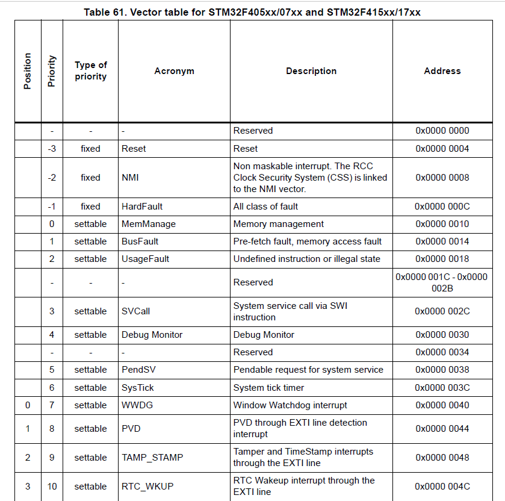
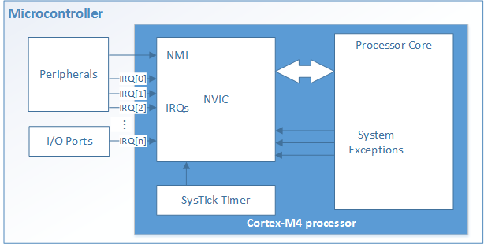
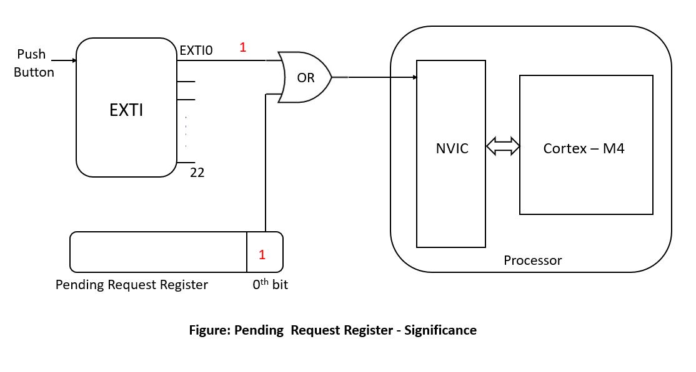
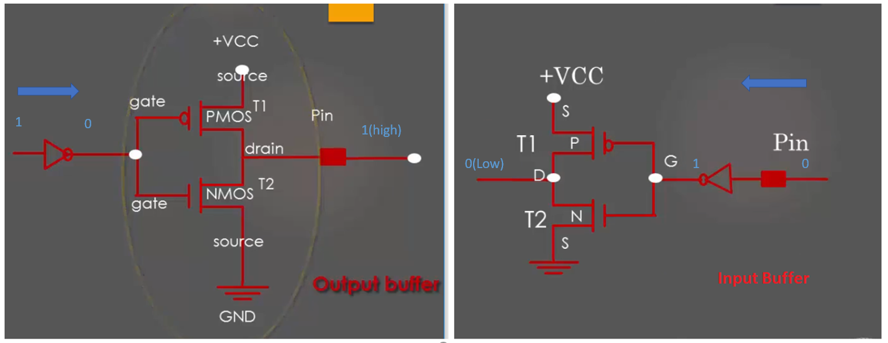
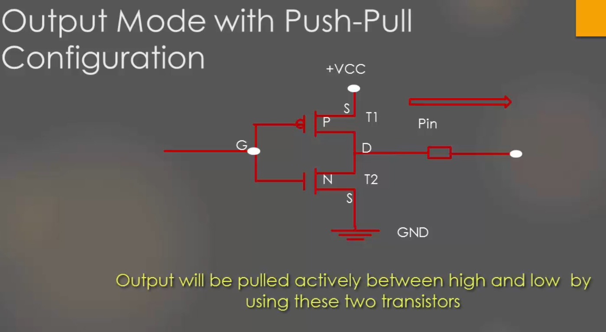
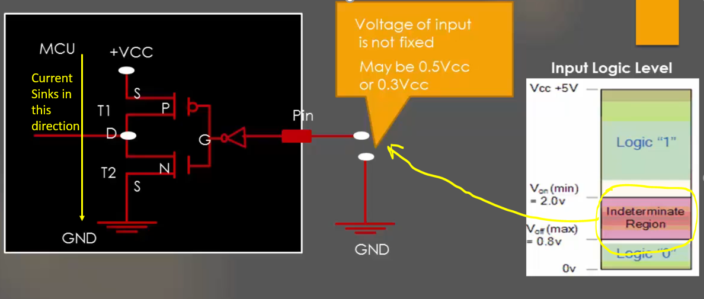
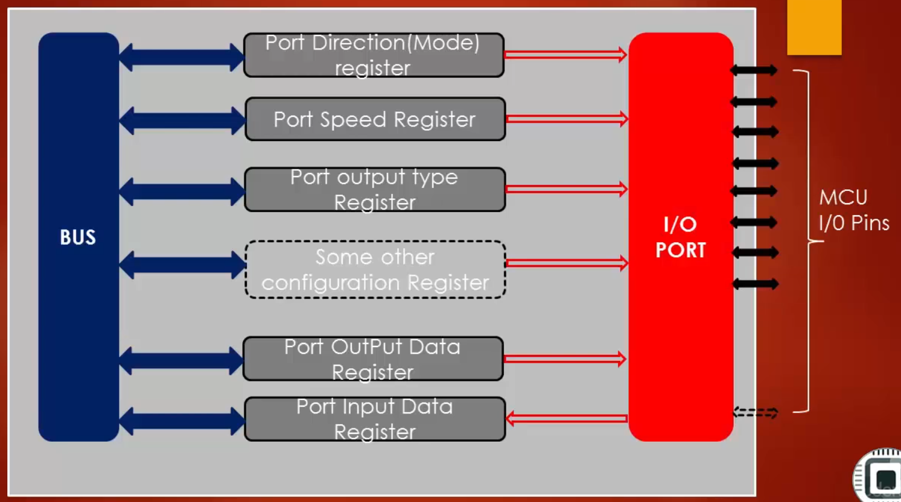

# Exploring STM32F407 Discovery Board
The main purpose of this project is to get an insight into the STM32F407 Discovery Board, which is an ARM Cortex M4 based Microcontroller. As I started working on STM32F07 Discovery Board, initially it was difficult and confusing to understand and program this microcontroller because understanding internal structures and working of the microcontroller using datasheet of STM32F407VGT MCU is difficult especially if one is a beginner.

                                      Figure 1 : STM32F407 Discovery Board

This project gives almost all the basic information needed to get started with STM32F407 Discovery Board and also development of driver code.

**Hardware Used** : STM32F4 DISCOVERY kit, for more information visit https://www.st.com/en/evaluation-tools/stm32f4discovery.html

**Software Tool** : Kiel MDK V5, for more information visit http://www2.keil.com/mdk5/. 
                For installation of Keil MDK V5 refer https://youtu.be/d_O2tu5CMbQ

**Note** : As this microcontroller has many advanced features and the main aim of this project is to get all basic insights, during the driver development only the required functionalities are added and other advanced functionality is not added. I may update the driver and other functionality in the future.

Please find the STM32F4 Discovery User Manual,STM32F4xxx Reference Manual (RM0090) and other related documents inside a folder called Documents. I will be referring to these documents for information such as block diagrams, register details ect.

## Overview of STM32F407VGT6 Microcontroller
**Please refer : Figure 6. STM32F407VGT6 block diagram from 'STM32F4 Discovery User Manual' (Page 12).**

The STM32F407 Discovery board uses STM32F407VGT6 Microcontroller which has **ARM Cortex-M4F** Processor, which is capable of running upto **168Mhz**. This MCU has many peripherals such as GPIO ports, TIMERS, ADCs, DACs, Flash Memory, SRAM, SPI, UART ect. The processor and peripherals talk via **BUS-Interface**.  There are three busses available :-
1. **I-BUS** (Instruction Bus)   
2. **D-BUS** (Data Bus)
3. **S-BUS** (System Bus)

**I-BUS**
This bus connects the Instruction bus of the Cortex®-M4 with FPUFloating point unit) core to the BusMatrix. This bus is used by the core to fetch instructions. The target of this bus is a memory containing code (internal Flash memory/SRAM or external memories through the FSMC/FMC).

**D-BUS**
This bus connects the databus of the Cortex®-M4 with FPU to the 64-Kbyte CCM data RAM to the BusMatrix. This bus is used by the core for literal load and debug access. The target of this bus is a memory containing code or data (internal Flash memory or external memories through the FSMC/FMC).

**S-BUS**
This bus connects the system bus of the Cortex®-M4 with FPU core to a BusMatrix. This bus is used to access data located in a peripheral or in SRAM. Instructions may also be fetched on this bus (less efficient than ICode). The targets of this bus are the internal SRAM1, SRAM2 and SRAM3, the AHB1 peripherals including the APB peripherals, the AHB2 peripherals and the external memories through the FSMC/FMC.

So instructions and data use I-bus and D-bus respectively, All the other peripheral uses System bus. The Cortex-M4 processor contains three external Advanced High-performance Bus (AHB)-Lite bus interface and one Advanced Peripheral Bus (APB) interface. The GPIOs are connected to AHB1 bus which has a maximum speed of 150Mhz and is divided into two buses as APB1 and APB2. APB1 runs at 42Mhz(max) and APB2 runs at 82Mhz(max). The different peripherals such as SPI, UART, TIMERs, ADCs, DACs, etc are connected to either APB1/APB2 buses. And the AHB2(168Mhz max) is connected to Camera and USB OTG interfaces, AHB3 is connected to External memory controller.

## Bus Matrix
**Please refer : Figure 7. System architecture from 'Using the STM32F2 and STM32F4 DMA controller(AN4031)' (page 18).**

Refering to the figure 7, The Yellow blocks are Master and blocks in Green are Slaves, there are lots of connected dots which actually says that there is path from master to slave for communication. In Microcontroller , the communication between the processors and the peripherals is seen in the scope of communication between master and slave. Here the processor ARM Cortex-M4 itself is a master, and it may have other masters such as Ethernet, High Speed USB 2.0, DMA1 and DMA2.

## Clock

STM32F407VGT6 Micorcontroller has 3 main clock sources:

1. **Crystal Oscillator(HSE)** - This is external clock source which can be connected to MCU based on requirements. HSE standas fro High speed External.
2. **RC Oscillator (HSI)** - All modern MCU comes with internal RC Oscillator, which can be just activated to use. HSI stands fro  High Speed Internal.
3. **PLL(Phase locked loop)** - It is also Implemented internally in MCU, It uses low frequency sources to generate high frequency
   clock (PLLCLK).
 
**Please refer : Figure 21. Clock tree from 'STM32F4xxx Reference Manual (RM0090)' (Page 216).**

**Note** : If your using **STM32 CUBE MX** tool, then select STM32F407 board and goto **clock configuration** for a much better clock tree representation.(I prefer to use this clock representation for easier understanding).

From above clock tree we can see that **HSI RC** is 16Mhz internal Clock, and an external oscillator (4Mhz to 26Mhz) has to be connected to **HSE** input and **PLL** takes HSI/HSE as input to produce various other clocks. All 3 of these clock sources are given to SYSTEM CLOCK MULTIPLEXER where we can select clock source, Output of this MUX is **SYSCLK**(i.e, System Clock).

- **SYSCLK** : This is the Main clock of MCU, using this other clocks are derived (Ex: Peripheral, Bus clocks ect). SYSCLK is given directly to Ethernet PTP Clock.
- **HCLK** : HCLK is derived from SYSCLK with a Prescaler in between , which brings down the clock frequency. HCLK goes directly to AHB bus, core, memory and DMA. HCLK goes to Cortex System Timer with prescalar in between and HCLK goes directly to Cortex Processor (FCLK Cortex Clock).
- **PCLK** : PCLK1 and PCLK2 are derived from HCLK, PCLK1 goes to APB1 peripheral clock and APB1 Timer Clock and PCLK2 goes to APB2 peripheral clock and APB2 Timer Clock.

By default MCU uses HSI (i.e internal RC Oscillator) as SYSCLK, Which means after reset HSI is used as SYSCLK Source. Before using any peripheral its clock should be enabled. Referring MUC Block Diagram, all different peripheral drives the clock from bus which it is connected. By default almost all the peripheral are deactive, which means there clocks are not enabled. **RCC**(Reset and clock Control) engine of MCU gives various registers to enable and disable various peripheral clocks. For more information refer RCC section of STM32F4xxx Reference Manual (RM0090), page-213.  

## Vector Table
It is a table of Vectors. Generally, Vectors are related to directions. We know that **VECTORS** in physics has both magnitude and direction. In our context we can compare **pointers** and **direction**, as pointers will point to certain addresses. So we can say that Vector table is a table which holds the specific addresses. It contains the addresses of **Exception Handlers**. Here system exceptions(these are MCU internally generated) and Interrupts(Which are external) are collectively called as exceptions.

**Referring : Table 61. Vector table for STM32F405xx/07xx and STM32F415xx/17xx (Page 372 of RM0090)**

Above Vector table is not the complete table, it's just a part of it. Please refer the RM0090 for complete vector table. There are 6 columns in Vector Table: Position, Priority, Type of priority, Acronym, Description, and Address.
* **Position**: We can see that position is kept empty for all the system exceptions, system exceptions come from the processor end and vendor ST does not have control over system exceptions. These positions are with respect to **NVIC**(Nested vectored interrupt controller). For example, **Window Watchdog interrupt** is at **Position 0** w.r.t to NVIC. Another name for the position is IRQ Number.
* **Priority**: This column gives the priority of exceptions and interrupts. From the table, we can see that Reset has the highest priority of -3.
* **Type of Priority**: This column tells us that whether the priority of exceptions can be changed or not. Here Reset, NMI and Hard Fault has fixed priority type and the remaining exceptions have settable priority type which means its priority can be changed.
* **Address**: This column tells that where exactly in the processor memory map you have to keep the corresponding exception handler. A handler is just a C function which takes care of that exception. for example, if we have implemented a function to handle NMI exception in your program then address of that handler must be kept at **0x0000 0008**, that is function pointer should be kept in this addresses. The very first address that is **0x00000000** is reserved and it has special data known as **STACK Pointer value** in Cortex Processor. Before coming to the Reset handler, the processor loads the value stored in 0x00000000 location into stack pointer. Because always stack pointer must be initialized before entering into any handler. So we must keep a valid value at this address. All these initializations are handled in **startup code**.

## NVIC(Nested vectored interrupt controller)
Interrupts are a common feature supported by almost all microcontrollers. They are typically generated by hardware, for example peripherals or external input pins. When a peripheral or hardware needs service from the processor, this will lead to changes in program flow control outside the normal programmed sequence. Typically, the following sequences would occur:
1. The peripheral asserts an interrupt request to the processor.
2. The currently running task is suspended by the processor.
3. The processor executes an Interrupt Service Routine (ISR) to service the peripheral, and optionally the interrupt request is cleared 
   by software if needed.
4. The processor resumes the previously suspended task.
For every interrupt there must be a program associated with it. When an interrupt occurs, this program is executed to perform certain service for the interrupt. This program is usually named as Interrupt Service Routine (ISR) or interrupt handler.

As the above figure shows every Cortex-M4 processor provides a Nested Vectored Interrupt Controller (NVIC) for interrupt handling. NVIC facilitates low-latency exception and interrupts handling, controls power management and implements System Control Registers. The NVIC and the processor core interface are closely coupled, which enables low latency to interrupt processing and efficient processing of late arriving interrupts.

For this microcontroller, the NVIC receives interrupt requests from various sources. In addition to interrupt requests, ther are some other events which need servicing. They are called “exceptions” (which are MCU internally generated). For Cortex-M4 processor, exceptions include resets, software interrupts and hardware interrupts. Each exception has an associated 32-bit vector that stores the memory location where the ISR that handles the exception is located. These vectors are stored in ROM at the beginning of memory. As explained earlier Vector table holds the location of ISR. The Cortex-M4 NVIC supports up to 240 interrupt requests (IRQs), a non-maskable interrupt (NMI), a SysTick timer interrupt and a number of system exceptions. Most of these IRQs are generated by peripherals such as timers, GPIO ports and communication interfaces such as UARTs.
## MCU Interrupt Design
We can observe that not all interrupts go directly to NVIC. Some peripheral deliver their interrupt to NVIC over the EXTI Lines and Some peripheral deliver their interrupts directly to NVIC. This is the design of STM.

**Refer: Figure 41. External interrupt/event controller block diagram (Page 380 of RM0090)**

STM MCU has an engine called **EXTI(External interrupt/event Controller)**. This engine is hanging on APB2 bus, so it drives the clock from PCLK2. This engine is finally connected to NVIC Interrupt Controller. This engine gives 23 lines to NVIC. In the vector table, we can see 23 entries related to EXTI.

In EXTI it is important to know about **Pending Request Register**. This Register tells us on which EXTI line an interrupt is pending. When an interrupt occurs corresponding bit in this register goes high. Once the interrupt event is finished, its programmer responsibility to clear this bit. If the bit is not cleared it leads to a bug. For instance consider that when a **push-button** is pressed an interrupt is generated, this interrupt is given to NVIC via EXTI0 Line as shown below in the figure: Pending Request register Significance.

So when the push-button is pressed, **EXTI0** line goes high and also a corresponding bit in pending request register goes high. So both input to the OR gate is one hence an interrupt is triggered on NVIC. If we do not clear this bit in pending request register after the event is finished EXTI0 goes low but one of input to OR gate remains high due to pending request register so even though an interrupt event is completed an interrupt is continuously triggered in NVIC which leads to a problem. So it is important to clear this bit after the interrupt event is completed. 

**Refer: Figure 42. External interrupt/event GPIO mapping (STM32F405xx/07xx and STM32F415xx/17xx) (Page 382 of RM0090)**

Figure 42 shows how exactly the GPIOs are delivering their interrupts to NVIC. The 168 GPIOs are connected to the 16 external interrupt/event lines as shown above. All the 0th Pins (PA0, PB0, PC0, PD0, PE0, PF0, PG0, PH0, and PI0) of GPIO ports are connected to EXTI0 line through MUX, In a similar way from figure42, we can see that how remaining pins deliver their interrupts. The **EXTI0[3:0]** bits in the **SYSCFG_EXTICR1** register is used to select the source input for the EXTIx external interrupt.

## GPIO(General Purpose Input/Output)
Before we start with GPIO in our MCU, it is necessary to know about the basic concepts related to GPIO. These concepts are generic and can be applied to any MCU. GPIO port is a collection of a fixed number of input/output pins. Let us explore how GPIO pins work in MCU in a very simple way. Below figure shows the behind the scene implementation of GPIOs in MCU.

As shown in the above figure, it has one input buffer and one output buffer along with the enabling line. When the enable line is 0, the output buffer gets activated and the input buffer is OFF. When enable is 1, the input buffer is ON and the output buffer is OFF. Buffer is nothing but two CMOS transistor connected as shown below.

**Output Buffer**: When you write 1 on this buffer, due to the inverter logic 0 is given as input to two transistors and hence T1 will be activated and T2 will be deactivated. Hence pin will be pulled to high. When you write 0 to this buffer, due to the inverter logic 1 is given as input to two transistors and hence T1 will be deactivated and T2 will be activated. Hence pin will be pulled to ground(low). This is how the output buffer of GPIO works.

**Input buffer**: We can observe here that the input buffer is simply the rotation of output buffer in 180 degrees. When the pin is driven high, T1 will be ON and  T2 will be OFF hence you will read High. When the pin is driven low, T1 will be OFF and T2 will be ON hence you will read Low.

This is how the input and output mode of a GPIO pin works behind the scene with its respective buffers and enable line. This enable line is usually configured by a  GPIO control register which will be discussed later.

### GPIO Input Mode with High Impedance State
High Impedance is also called a HIGH-Z state. HIGH-Z state of an I/O pin is nothing but keeping the pin in **Floating State** i.e, neither connected to High nor connected to low voltage level as shown below.

When a microcontroller power-ups, by default all the GPIO pins will be in Input-Mode with HIGH-Z state or floating state. This applies to almost all the MCU. Keeping the pin in the Floating state can lead to leakage current which may lead to higher power consumption. This is because pin in a floating state is highly susceptible to picking up the circuit noise voltage and results in leakage current.

### GPIO Input Mode with Pull-Up/Pull-Down Configuration
Floating state of the pin can be avoided by simple internal pull-up or pull-down resistors as shown in the below figure.

There is Configuration register for every GPIO port which enables you to handle these internal pull-up/pull-down registers. It is always safe to keep the unused GPIO pins in one of these states so that they are reluctant to voltage fluctuations which may lead to leakage of current.

### GPIO Output Mode with Open Drain Configuration
The Output Mode with open-drain configuration is nothing but the top PMOS transistor simply not present as shown below.

So we have a single NMOS transistor(T2) when T2 is ON the output is pulled to low. When T2 is OFF, the drain of the transistor is in floating/open state. This is the reason it is called open-drain. Hence GPIO output mode with open-drain configuration has only pull-down capability not the pull-up. So there are two states available in this configuration **Pull-Down** and **Float**. The floating state is useless. Opend drain output configuration is useless until you provide pull-up capability either by internal pull-up transistor or external pull-up transistor. That leads to the next topic which is open-drain with internal and external pull-ups.

### GPIO Output Mode - Open Drain with Pull-Up

Above figure shows the GPIO Output mode in Open drain with internal and external pull-up configuration. So to use of open-drain configuration in real-world application it has to be used along with either internal/external pull-up resistor. These days all MCU supports internal pull-up, which can be activated/deactivated using GPIO Configuration Registers.

### GPIO Output Mode with Push-Pull Configuration
When the GPIO pins are configured as input, the default state is HIGH-Z state. But when GPIO pin is configured as Output, then by default it will be in Push-Pull Configuration as shown in the below figure.

This output configuration is called Push-Pull because the output will be pulled actively High and Low by using the two-transistors. In the push-pull configuration, there is no need for any pull-up/pull-down resistor. This configuration has two transistors. The Top transistor(PMOS) will be ON when output has to be driven HIGH. The bottom transistor(NMOS) will be ON when the output should be driven to LOW.

### Optimizing I/O Power Consumption
As discussed earlier, we know that if the pin is in the floating state then it leads to leakage current from VCC to GND(Ground). Let us consider the case where the input pin is not in the floating state,  that is it is connected to either a fixed HIGH or LOW voltage level as shown in the below figure.

Referring  from the above figure, when the pin is fixed to HIGH voltage, due to the inverter logic input to buffer will be 0, the transistor T1 is ON and T2 is OFF and hence there is no path for the current to reach the ground, in this case, leakage will not happen as current never leaks out from +VCC to Ground. When the pin is fixed to LOW, T1 is OFF and T2 is ON, in this case also current will not leak as there is no path from VCC to Ground. Let us Now Consider the floating state as shown below.

In this case, the pin input voltage is not fixed, due to the circuit noise the input voltage to pin may toggle between (70 to 50)% of VCC to 30% of VCC. That is the voltage on the pin will be in the intermediate
region as shown in the above figure, this turns on both the transistors hence a small amount of current sinks to ground as shown. But all the modern MCUs I/O pins use Schmitt trigger to combat the noise issue.
    
## GPIO Register Structure

Each GPIO port is governed by many registers as shown above. These registers may vary depending on the vendors who manufacture it. Generally in MCU GPIO port is governed by these registers. The Minimum set of registers you find in any MCU for GPIO port
includes:

* **Port Direction (Mode) Register**: using which you can set the IO modes such as input, Output, Analog, etc.
* **Port Input Data register**: Used to read from GPIO port.
* **Port Output Data Regitser**: Used to write to a GPIO Port.

In STM32F4xx series of microcontrollers, each GPIO port is governed by many configuration registers. You can find more about all different GPIO registers in **Section 8.4 GPIO Register(Page 281 in STM32F4xxx Reference Manual (RM0090))**. From STM32F407VGT6 block diagram we can see that all the GPIO ports are conected to Cortex-M4 processor via AHB1 Bus. AHB1 bus is the main system bus which can be operated at a maximum speed of 168Mhz.
                                                                                        
### GPIO Ports and Pins of STM32F4xx
The STM32F407VGT6 Microcontroller supports 9 GPIO ports(i.e, GPIOA to GPIOI). Each GPIO port is a group of 16 GPIO pins and each port has its own set of configuration registers. The MCU supports total 114 GPIO pins, but on the development board the manufacture brought out  5 ports (i.e, GPIOA to GPIOE). So Totally 80 Pins are available as shown below.

## GPIO Regitsers 
**(Refer : Section 8.4 GPIO Regitser (Page 281 in STM32F4xxx Reference Manual (RM0090))**

### 1. GPIO port mode register (GPIOx_MODER) (x = A..I/J/K)
This register is used to configure the mode of a particular GPIO pin. Before using any GPIO port we should decide its mode that is whether you want to use it as input, output, alternate functionality or analog mode.

**MODERy[1:0]**: Port x configuration bits (y = 0..15), these bits are written by software to configure the I/O direction mode.

- 00: Input (reset state) -> By default.
- 01: General purpose output mode
- 10: Alternate function mode -> Such as UART, SPI, I2C ect.
- 11: Analog mode

### 2. GPIO port output speed register (GPIOx_OSPEEDR)** (x = A..I/J/K)
When the GPIO pin is in the output mode, this register is used to choose the output type. 

**OTy[15:0]**: Port x configuration bits (y = 0..15), These bits are written by software to configure the output type of the I/O port.

- 0: Output push-pull (reset state)
- 1: Output open-drain

### 3. GPIO port output speed register (GPIOx_OSPEEDR) (x = A..I/J/K)
This is register is used to configure the speed of the GPIO pins.

**OSPEEDRy[1:0]**: Port x configuration bits (y = 0..15), these bits are written by software to configure the I/O output speed.

- 00: Low speed
- 01: Medium speed
- 10: High speed
- 11: Very high speed

**Note**

1. LOW-speed GPIO consumes less power as compared to HIGH-Speed GPIO.
2. But low-speed GPIO have larger (Trise ->rising edge) and (Tfall->falling edge) which we call Slew Rate when the speed is low rise and fall of GPIO is not quick enough which may not be suitable for some applications.
3. Reference manual of this MCU claims that pins fastest toggle speed is every two clock cycle. That means if the GPIO is High and it wants to go low then it needs minimum two processor clock cycle. Let's say if MCU is running at 48Mhz then the fastest toggle speed is 24Mhz.

### 4. GPIO port pull-up/pull-down register (GPIOx_PUPDR) (x = A..I/J/K)
This register is used to configure internal pull-up/pull-down register on each I/O pin. Internal pull-up/pull-down registers can be configured in the GPIO pin which is in input or output mode. 

Bits 2y:2y+1 **PUPDRy[1:0]**: Port x configuration bits (y = 0..15), these bits are written by software to configure the I/O pull-up or pull-down.

- 00: No pull-up, pull-down
- 01: Pull-up
- 10: Pull-down
- 11: Reserved 

### 5. GPIO port input data register (GPIOx_IDR) (x = A..I/J/K)
It is a 32-bit read-only register in which only the lower 16-bits are used and upper 16-bits are not used. Each bit represents the input voltage level of the I/O pin belonging to the particular GPIO port. For example, if the value of bit-6 of the GPIOC_IDR register is 0, then the input voltage of the 6th IO pin of the Port C is 0V. Which indicates that voltage on PC6 is 0V. If bit-8 of the GPIOC_IDR register is 1 input voltage of the 8th IO pin of the Port C(PC8) is 3.3V. Reading this register gives voltage on each pin of a GPIO Port.

### 6. GPIO port output data register (GPIOx_ODR) (x = A..I/J/K)
This is also a 32-bit write-only register in which only the lower 16-bits are used and upper 16-bits are not used. In this register, each bit position is used to write an output value for a corresponding pin of the port. For example, if you want to drive PC8 to  +VDD(3.3V), then write 1 to the corresponding bit position i.e, 8th bit of the GPIOC_ODR register. Similarly, if you want to drive  PC6 to GND(0V) then write 0 to the corresponding bit position i.e, 6th bit of the GPIOC_ODR register.

### 7. GPIO Alternate Function Register
This is one of the important GPIO configuration registers. This register is used to configure the alternate functionality of the particular pin of GPIO Port. In this MCU there are two alternate function registers.

1. **GPIO alternate function low register (GPIOx_AFRL) (x = A..I/J/K)** -> Used for Pin 0 to 7.
2. **GPIO alternate function high register (GPIOx_AFRH) (x = A..I/J)**  -> Used for Pin 8 to 15.

Each GPIO Pin supports 16(AF0 to AF15) Different alternate functions. This means that each GPIO pin can be configured into one among the 16 different alternate functions. Since there are 16 possible alternate functions for each pin, 4-bits are needed to configure each GPIO pin. So Alternate function low register is used for Pin 0 to Pin 7, whereas Alternate function high register is used for Pin 8 to Pin 15. To know about all the 16 different alternate functions -> Refer **Figure 26. Selecting an alternate function on STM32F405xx/07xx and STM32F415xx/17xx(Page 272 of RM0090).**

### 8. RCC AHB1 peripheral clock register (RCC_AHB1ENR)
To be able to work with any peripheral in an MCU first, you have to make sure that its peripheral clock(**fpclk**) is enabled. In STM32F4xx MCU, all the peripheral clocks are managed by RCC(Reset and Clock control) Block. GPIO port is also a peripheral and it is connected to AHB1 bus. The peripheral clock of GPIO port is derived from AHB1 bus clock. By default, all peripheral clocks are disabled to saving power, so it is important to enabling the clock before configuring or using any peripheral. The **RCC AHB1 peripheral clock enable register (RCC_AHB1ENR)** is used for this, as the name indicate this register is used to **enable/disable the clock for the peripherals** which are connected to AHB1 bus. For more details Refer **6.3.10 RCC AHB1 peripheral clock register (RCC_AHB1ENR)(Page 180 of RM0090).**
