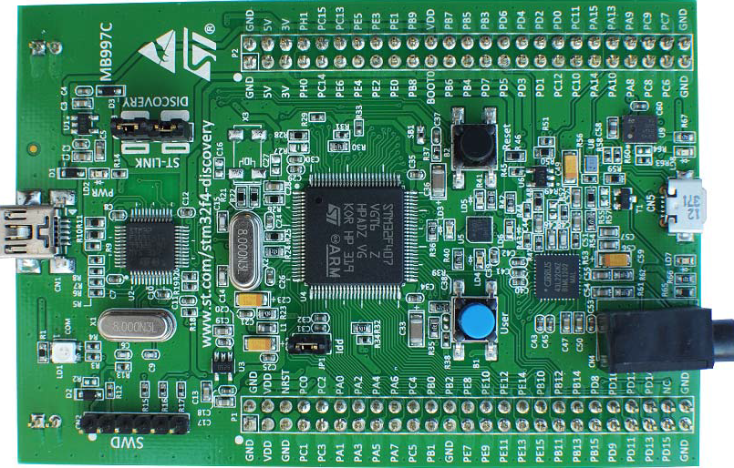
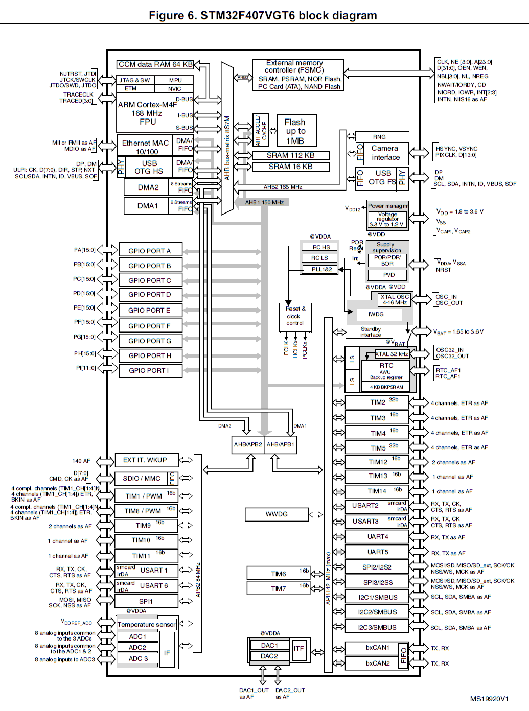
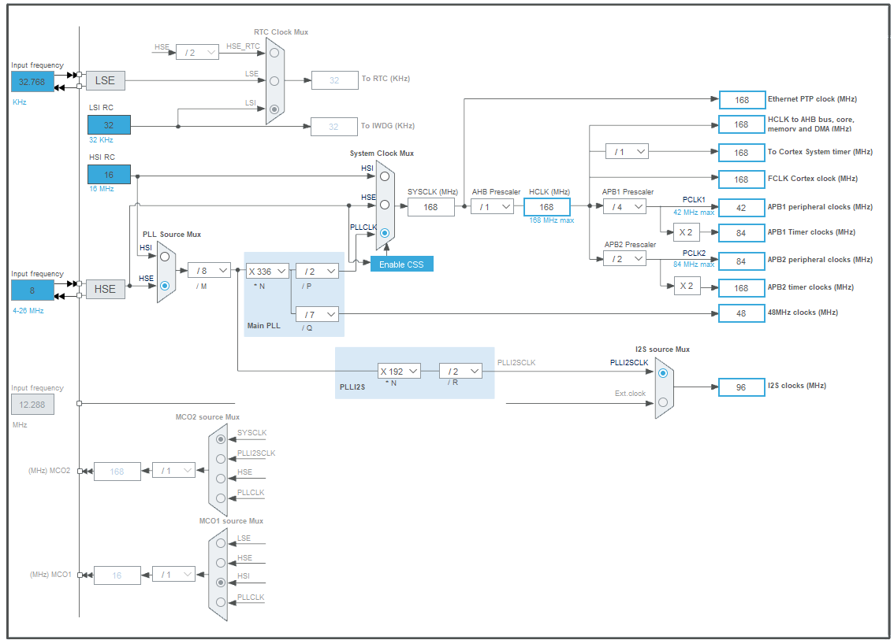

# Exploring STM32F407 Discovery Board
The main purpose of this project is to get an insight into the STM32F407 Discovery Board, which is an ARM Cortex M4 based Microcontroller. As I started working on STM32F07 Discovery Board, initially it was difficult and confusing to understand and program this microcontroller because understanding internal structures and working of the microcontroller using datasheet of STM32F407VGT microcontroller is difficult especially if one is a beginner.

                                      Figure 1 : STM32F407 Discovery Board

This project gives almost all the basic information needed to get started with STM32F407 Discovery Board and also development of driver code.

**Hardware Used** : STM32F4 DISCOVERY kit, for more information visit https://www.st.com/en/evaluation-tools/stm32f4discovery.html

**Software Tool** : Kiel MDK V5, for more information visit http://www2.keil.com/mdk5/. 
                For installation of Keil MDK V5 refer https://youtu.be/d_O2tu5CMbQ

**Note** : As this microcontroller has many advanced features and the main aim of this project is to get all basic insights, during the driver development only the required functionalities are added and other advanced functionality is not added. I may update the driver and other functionality in the future.

Please find the STM32F4 Discovery User Manual,STM32F4xxx Reference Manual (RM0090) and other related documents inside a folder called Documents. I will be referring to these documents for information such as block diagrams, register details ect.

## Overview of STM32F407VGT6 Microcontroller
**Please refer : Figure 6. STM32F407VGT6 block diagram from 'STM32F4 Discovery User Manual' (Page 12).**

The STM32F407 Discovery board uses STM32F407VGT6 Microcontroller which has **ARM Cortex-M4F** Processor, which is capable of running upto **168Mhz**. This MCU has many peripherals such as GPIO ports, TIMERS, ADCs, DACs, Flash Memory, SRAM, SPI, UART ect. The processor and peripherals talk via **BUS-Interface**.  There are three busses available :-
1. **I-BUS** (Instruction Bus)   
2. **D-BUS** (Data Bus)
3. **S-BUS** (System Bus)

**I-BUS**
This bus connects the Instruction bus of the Cortex®-M4 with FPUFloating point unit) core to the BusMatrix. This bus is used by the core to fetch instructions. The target of this bus is a memory containing code (internal Flash memory/SRAM or external memories through the FSMC/FMC).

**D-BUS**
This bus connects the databus of the Cortex®-M4 with FPU to the 64-Kbyte CCM data RAM to the BusMatrix. This bus is used by the core for literal load and debug access. The target of this bus is a memory containing code or data (internal Flash memory or external memories through the FSMC/FMC).

**S-BUS**
This bus connects the system bus of the Cortex®-M4 with FPU core to a BusMatrix. This bus is used to access data located in a peripheral or in SRAM. Instructions may also be fetched on this bus (less efficient than ICode). The targets of this bus are the internal SRAM1, SRAM2 and SRAM3, the AHB1 peripherals including the APB peripherals, the AHB2 peripherals and the external memories through the FSMC/FMC.

So instructions and data use I-bus and D-bus respectively, All the other peripheral uses System bus. The Cortex-M4 processor contains three external Advanced High-performance Bus (AHB)-Lite bus interface and one Advanced Peripheral Bus (APB) interface. The GPIOs are connected to AHB1 bus which has a maximum speed of 150Mhz and is divided into two buses as APB1 and APB2. APB1 runs at 42Mhz(max) and APB2 runs at 82Mhz(max). The different peripherals such as SPI, UART, TIMERs, ADCs, DACs, etc are connected to either APB1/APB2 buses. And the AHB2(168Mhz max) is connected to Camera and USB OTG interfaces, AHB3 is connected to External memory controller.

## Bus Matrix
**Please refer : Figure 7. System architecture from 'Using the STM32F2 and STM32F4 DMA controller(AN4031)' (page 18).**

Refering to the figure 7, The Yellow blocks are Master and blocks in Green are Slaves, there are lots of connected dots which actually says that there is path from master to slave for communication. In Microcontroller , the communication between the processors and the peripherals is seen in the scope of communication between master and slave. Here the processor ARM Cortex-M4 itself is a master, and it may have other masters such as Ethernet, High Speed USB 2.0, DMA1 and DMA2.

## Clock

STM32F407VGT6 Micorcontroller has 3 main clock sources:

1. **Crystal Oscillator(HSE)** - This is external clock source which can be connected to MCU based on requirements. HSE standas fro High speed External.
2. **RC Oscillator (HSI)** - All modern MCU comes with internal RC Oscillator, which can be just activated to use. HSI stands fro  High Speed Internal.
3. **PLL(Phase locked loop)** - It is also Implemented internally in MCU, It uses low frequency sources to generate high frequency
   clock (PLLCLK).
 
**Please refer : Figure 21. Clock tree from 'STM32F4xxx Reference Manual (RM0090)' (Page 216).**

**Note** : If your using **STM32 CUBE MX** tool, then select STM32F407 board and goto **clock configuration** for a much better clock tree representation.(I prefer to use this clock representation for easier understanding).

From above clock tree we can see that **HSI RC** is 16Mhz internal Clock, and an external oscillator (4Mhz to 26Mhz) has to be connected to **HSE** input and **PLL** takes HSI/HSE as input to produce various other clocks. All 3 of these clock sources are given to SYSTEM CLOCK MULTIPLEXER where we can select clock source, Output of this MUX is **SYSCLK**(i.e, System Clock).

- **SYSCLK** : This is the Main clock of MCU, using this other clocks are derived (Ex: Peripheral, Bus clocks ect). SYSCLK is given directly to Ethernet PTP Clock.
- **HCLK** : HCLK is derived from SYSCLK with a Prescaler in between , which brings down the clock frequency. HCLK goes directly to AHB bus, core, memory and DMA. HCLK goes to Cortex System Timer with prescalar in between and HCLK goes directly to Cortex Processor (FCLK Cortex Clock).
- **PCLK** : PCLK1 and PCLK2 are derived from HCLK, PCLK1 goes to APB1 peripheral clock and APB1 Timer Clock and PCLK2 goes to APB2 peripheral clock and APB2 Timer Clock.

By default MCU uses HSI (i.e internal RC Oscillator) as SYSCLK, Which means after reset HSI is used as SYSCLK Source. Before using any peripheral its clock should be enabled. Referring MUC Block Diagram, all different peripheral drives the clock from bus which it is connected. By default almost all the peripheral are deactive, which means there clocks are not enabled. **RCC**(Reset and clock Control) engine of MCU gives various registers to enable and disable various peripheral clocks. For more information refer RCC section of STM32F4xxx Reference Manual (RM0090), page-213.  
