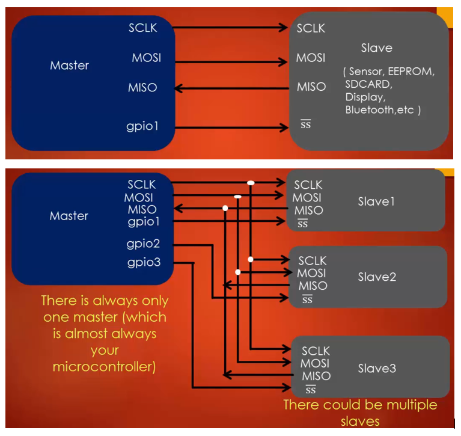

## SPI (Serial Peripheral Interface)

SPI is an interface bus commonly used to send data between Microcontroller and small peripherals such as Sensor, Memory chip, etc. It uses separate **clock** and **data** lines along with select line to choose the device it wants to communicate. The side that generates the clock is called **master** and another side is called **slave**. There is always one master(i.e MCU) and multiple slaves. SPI is a single master protocol, this means that only one central device initiates communication with multiple slaves. A slave cannot be able to change its role from slave to master.  SPI is a protocol of 4 lines, they are:

* **SCLK(Clock Signal)** - The Clock is sent from master to slave through this line, all the SPI signals are synchronous to this clock.
* **Slave Select(SS)** - This line is used to select the slave device. Whenever the master wants to communicate to slaves, it pulls the corresponding slave select line to low.
* **MOSI(Master out slave in)** - Master sends data to the slave over MOSI line.
* **MISO(Master in Slave out)** - Slave sends the data to master over MISO line

Here are some websites where you can get to know about how SPI protocol works: [SPI-Link1](https://www.allaboutcircuits.com/technical-articles/spi-serial-peripheral-interface/)  [SPI-Link2](http://www.circuitbasics.com/basics-of-the-spi-communication-protocol/)  [SPI-Link3](http://maxembedded.com/2013/11/serial-peripheral-interface-spi-basics/)

### Significance of Clock phase and Clock polority
Clock Phase and Clock Polarity are two most important terminologies used in the SPI protocol. These are very important parameters which need to be configured before using the SPI peripherals.

#### Clock Polarity(CPOL)
CPOL parameter decides the clock format to be used by the SPI peripheral. There are two clock format permitted one is **Inverted** and another is **Non-inverted**.
* **Non-inverted (CPOL = 0)** : When the **CPOL** parameter is set to **0**, the clock is Non-inverted, which means that the base value of the clock =0. In other words, we can say that the **active state** of the clock is **HIGH(1)** and idle state of the clock is **LOW(0)**. In this case, the **leading-edge** of the clock is **rising** and **trailing-edge** of the clock is **falling** as shown in the figure below.

* **Inverted(CPOL =1)**: When the **CPOL** parameter is set to **1**, the clock is Inverted, which means that the base value of the clock =1. In other words, we can say that the **active state** of the clock is **LOW(0)** and **idle state** of the clock is **HIGH(1)**. In this case, the **leading-edge** of the clock is **falling** and **trailing-edge** of the clock is **rising** as shown in the figure below.

#### Clock Phase(CPHASE)
Clock Phase defines when the data has to be **toggled** and when the data has to **sampled** on the data lines of the SPI peripheral. Data toggling means data transition to the next bit. Data sampling means sampling data lines to capture the data as shown below.

If **CPHASE = 0**, the Data will be sampled on the leading edge of the clock, IF **CPHASE=1** then the data will be sampled on trailing edge of the clock. So Phase defines at which edge the data has to be sampled and at which edge the data has to be toggled. Below figure shows a case when CPOL=1 and CPHASE =1.

Based on the combination of CPHASE and CPOL there are 4 different modes in SPI, you can find more about SPI modes here [SPI MODES](https://www.allaboutcircuits.com/technical-articles/spi-serial-peripheral-interface/)

## SPI functional description
**Refer to Figure 246. SPI block diagram (Page 876 of RM0090)**

From block diagram we can see that 4 pins are coming out - **MOSI**, **MISO**, **SCLK** and **NSS(Slave select)**. The heart of the SPI block is the **shift register** with two **buffers**, one is the **TX buffer** another is the **RX Buffer**. TX and RX buffer are accessible over APB1/APB2 Bus. To transmit the data, the data has to be written into the TX buffer, whose content then get loaded to shift register which is then transmitted. When the shift register receives the complete byte, it transfers it to RX buffer where we can read it. Then we have a couple of control register **SPI_CR1**, **SPI_CR2** which are used to control SPI operations and one status register **SPI_SR**, it holds the status of various SPI events such TX event, RX event, and error event, etc. The clock is produced by **baud rate generator** block which is controlled by BR0, BR1, BR2 bits in control register.

### SPI Peripheral Clock & Serial Clock
In this MCU there are 3 SPI peripherals, Out of which **SPI1** is connected to **APB2**, **SPI2** and **SPI3** are connected to **APB1** bus. SPI clock speeds are dependent on APB1/APB2 bus. We already know APB1 bus has a speed of max 42MHz and APB2 has max 84Mhz. These are represented by peripheral clock frequency **fpclk**. So for the  SPI2/SPI3, the max clock speed is  42Mhz as it is hanging on APB1 bus. We can see from the below figure that **fpclk**  is given to SP2/SPI3, after this, there is Prescaler whose minimum value is 2  and it results in **SCLK(Serial Clock)**. So if we take HSI(16Mhz) as a clock source, APB1/APB2 will have 16Mhz speed and hence fpclk = 16Mhz and SCLK = 8Mhz.

## SPI Registers
**Refer : Section 28.5 - SPI and I2S registers (Page 916 of RM0090)**
### 1. SPI control register 1 (SPI_CR1)
In this Control Register the first two bits i,e. **CPOL** and **CPHA** are used to configure the **SPI Mode**. Since the reset value of this register is 0, by default SPI mode will be 0.  The next three bits **BR[2:0]** controls the SPI serial line (SCLK) speed. **SPE**(Bit 6) is used to enable the SPI peripheral until this bit is 1 SPI peripheral will never work. Please read the reference manual for complete detail about SPI_CR1 register.

### 2. SPI control register 2 (SPI_CR2)
The 3 important bits we are interested in this register are TXEIE, RXNEIE, and ERRIE.

* **TXEIE(Tx buffer empty interrupt enable)** - This bit enables the interrupt for Transmit buffer empty event(TXE). Whenever the **TX buffer** is empty, **TXE** flag is set in the Status register and firmware will get interrupt if TXEIE bit is enabled. If TXEIE is 0, then the firmware will not get any interrupt when the TXE flag is set in the status register.

* **RXNEIE(RX buffer not empty interrupt enable)** - This bit enables the interrupt for the RX buffer not empty event. Whenever the **RX buffer** is not empty i.e, it has some data to be read, then the **RXNE** flag will be set in status register and firmware will get interrupt when RXNEIE bit is enabled. If RXNEIE is 0, then the firmware will not get interrupt when RXNE is set in the Status register.

* **ERRIE(Error interrupt enable)** -  This bit enables the interrupt for error events such as Over-run error and Under-run error etc.

### 3. SPI data register (SPI_DR)
SPI data register is **16-bit wide**, but if you transmit only one byte at a time then **upper-byte (bit 8 to 15)** are not used. SPI also allows you to transfer 16bit at a time that's the reason data register is 16bit wide but by default its 1byte. The data register is split into **2 buffers** - one for **writing (Transmit Buffer)** and another one for **reading (Receive buffer)**.  A **write to the data register** will write into the **Tx buffer** and a **read from the data register** will return the value held in the **Rx buffer**.

To understand these **read** and **write** operation refer the above figure, the data register sits between these two buffers, one is TX buffer and another one is RX buffer. Whenever firmware wants to write data then it writes it into the data register which is then transferred instantly to the TX buffer. Whenever firmware reads the data register, the value stored in the RX buffer will be returned. So firmware cannot access RX and TX buffers directly, but it can access it via data register. The data register is like a window to peek into the TX and RX buffers.

### 4. SPI status register (SPI_SR)
The First two bits holds **TXE** and **RXNE** events. When TX buffer is empty TXE bit is set to 1. When RX buffer is not-empty RXNE bit is set. The TXE and RXNE bits are very useful during data transfer, firmware should either poll these bits or get interrupt upon setting these bits during data transmission. The FRE, OVR, MODF, CRC ERR, UDR are used to indicate error events.  These flags are set when the corresponding error occurs. BSY (busy flag), is set whenever SPI is doing TX/RX.

## Configuring NSS(Slave Select) Pin
The **NSS pin** i.e, the **Slave select pin**  which is typically on the slave side is used to select the slave for communication. The Master drives the **NSS** pin of the slave to **low** whenever it wants to communicate with that particular slave as shown below.

In STM32F4xx based microcontroller, the NSS pin can be handled in 2 ways.
1. Software Slave Management
2. Hardware Slave Management

### 1.Software Slave management
When software slave management is enabled using **SSM** bit in **SPI_CR1** register(i.e., when SSM bit is 1), the **NSS** pin cannot be driven **high** or **low** by external IO lines from  other devices such as master, instead this NSS pin is handled by software by using **SSI** bit in **SPI_CR1** register. The value of SSI bit is forced onto the NSS pin and the IO value of NSS is ignored.

* If software makes **SSI=1**, then **NSS** pin goes **HIGH**.
* If software makes **SSI=0**, then **NSS** pin goes **LOW**.

So when software slave management is used, SSI bit acts as **handle** to drive **NSS** pin. So no extra pin is needed to be connected from master to slave. The advantage of using software slave management is that when there are only one master and one slave, then there is no need to connect a pin from master to slave to drive the NSS pin, which saves one Pin.

### 2. Hardware Slave management
When there are multiple slaves, then SSM(Software slave management) cannot be used. So when you make SSM =0, then the slave will be in **hardware slave select mode**, which means that NSS pin can be driven low by using external IO pins such as masters GPIO pins as shown below, the master should driver the NSS pin of the slave to LOW before communicating with that slave.

When the device is in Master-mode (**refer to page 877 of RM0090**), the NSS pin is not used and must be kept high. The way to do so is simply select SSM=1. 

**Note**: It is recommended to enable SPI (that is **hal_spi_enable()**) after all the necessary settings are configured for a given SPI peripheral.

## SPI Interrupt Handling
Let us understand how the SPI peripheral will interrupt the processor. Please refer section **28.3.11 SPI interrupts (Page 898 of RM0090)** . 

The above table.126  is telling us that SPI peripheral can interrupt the processor in various cases. So when **Transmit buffer empty** event happens, the SPI peripheral will interrupt the processor only if you enable the control bit **TXEIE**. Similarly, if **Receive buffer not empty flag** event occurs, the SPI peripheral will interrupt the processor only when control bit **RXNEIE** is enabled. In the same way, the SPI peripheral will interrupt the processor when **error events** happen only when control bit **ERRIE** is enabled.

Every peripheral is given a dedicated line on which they interrupt the processor and the number of this line is called **IRQ number**.  So we need to find out on which IRQ number the SPI peripheral interrupts the processor. To find the IRQ number, refer **Table 61. Vector table for STM32F405xx/07xx and STM32F415xx/17xx (Page 372 of RM0090)**. From the vector table, we can see that **SPI1** and **SPI2** interrupts the processor on IRQ numbers **35** and **36** respectively and **SPI3** on line **51** as shown below.

We can also see the **vector addresses** from the vector table, for example for **SPI2** the vector address is **0x000000D0**, and you have to store your ISR function at this location only. So whenever SPI interrupts the processor, the processor will jump to this address and loads the ISR function which you stored here. Usually, no need to worry about these addresses, whenever you create a project a **start-up** code gets added which is specific to the MCU. If you open the startup code you can see the vector table, where all interrupt names are specified as shown below:

The above vector details are carefully written such that each ISR address fall into respective vector address, for example, the address of **SPI2_Handler** will be stored in the address **0x000000D0**. So all we need to do is just define the function SPI2_Handler in your application or driver code. Also, this ISR gets called during the various events listed in **Table 126. SPI interrupt request**, so the driver has to decode which event occurred before handling the interrupt.

