## USART(Universal Synchronous Asynchronous Receiver Transmitter) and UART(Universal Asynchronous Receiver Transmitter)
These are the hardware that converts parallel data into serial data. **UART** supports only asynchronous mode and **USART** supports both synchronous and asynchronous modes. All the modern MCUs come with USART. Unlike USB, Ethernet, there is no specific port for USART communication. They are commonly used in conjunction with protocols like RS-232, RS-432, USB, etc. In Asynchronous transmission, a clock is not sent along with the data, instead synchronous bits like **start** and **stop** bits are used whereas in synchronous transmission a separate clock is sent along with the data hence start and stop bits are not required. 

Typically USART hardware will have the following components

* Baud-Rate Generator
* TX and RX Shift Registers
* Transmit/Receive Control Block
* Transmit/Receive Buffers
* First-In-First-Out( FIFO ) Buffer Memory

### Understanding UART Pins
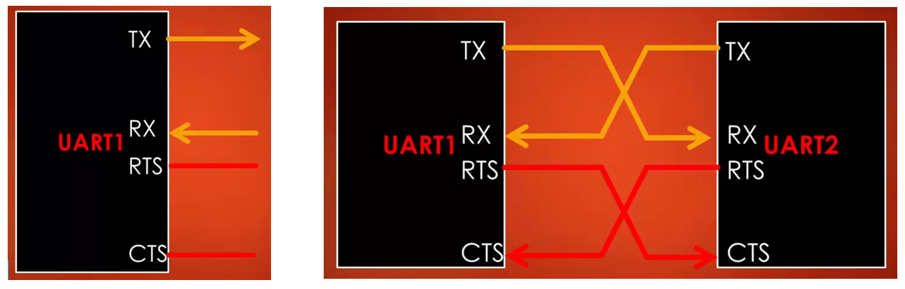

The UART Bi-Directional communication requires at least 2 pins **TX** and **RX**(When hardware flow control is not used). If we are not transmitting anything then the  TX line is held High which is the idle state. To receive data on the RX line, the UART module(UART RX Engine) continuously samples this line to detect the start bit of the frame. When the start bit is detected, frame reception starts on the RX line. The **RTS(Request to send)** and **CTS(Clear to send)** are required when hardware flow control is used. The CTS is an active-low pin when hardware flow control is used data transmission on the TX pin happens only when the CTS pin is held low.  The RTS is also an active-low pin, the UART module uses this line to request data from other devices. Referring above figure, when UART-1 wants data from UART-2, RTS of UART-1 goes low which makes CTS of UART-2 to go low and data transmission occurs between these two.

### UART Frame format
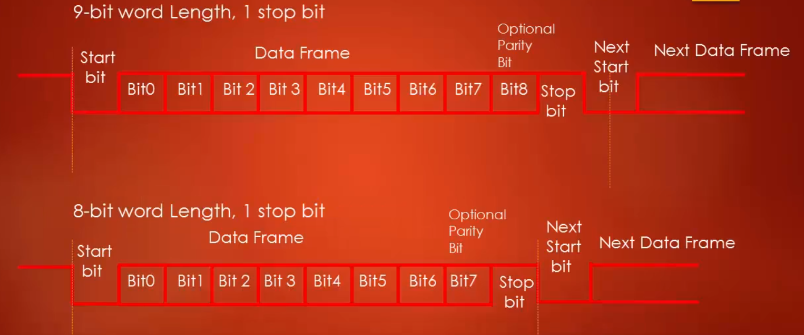

The frame refers to the entire data packet which is being sent or received during the communication. The typical frame format of the UART has this order of bits as shown above. The UART frame start with **start-bit** which is always low for the 1-bit duration. Then follows the data bits from LSB to MSB, this usually occupies 5 to 9 bits. We can decide how many data bits have to be there in a frame between 5 to 9 bits using configuration register in UART peripheral. Then follows the **parity-bit** which is optional. Finally, frame ends with the **stop-bit*** which is always high, we can configure stop bit duration to be either 1, 1.5 or 2-bit duration using configuration register.

### Baud Rate
The significance of the baud-rate is **how fast** the data is sent over the serial line. It's usually expressed in units of bits-per-second(bps). If you invert the baud-rate, you can find out, just how long it takes to transmit a single bit. This value determines how long the transmitter holds the serial line high or low.

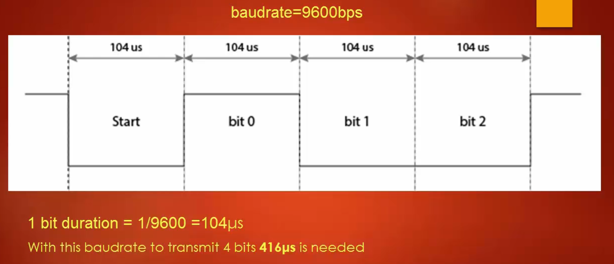

The baud rate can be just about any value, the only requirement is that both transmitting and receiving devices must operate at the same baud rate. Some of the commonly used baud rates are 2400,4800,9600,19200,38400, 57600 and 115200. Higher the baud-rate the faster is data sent/received, however, there are limits. The baud-rate is usually dependent on UART peripheral clock frequency. 

### UART Synchronization bits
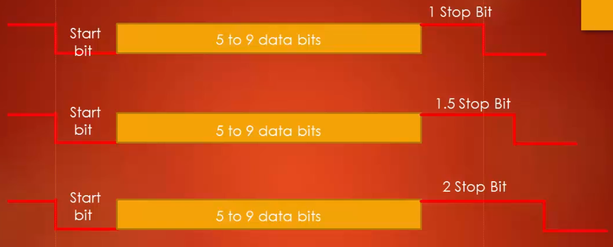

The start and stop bits mark the start and end of a frame. There is always one start bit but stop bit is configurable to 1 or 2 bits, in STM32F4xx MCU we can even choose 1.5 bits. The start bit is always indicated by an idle line going from high to low, Stop bit is indicated by the transition back to idle state by holding the line high.

### UART Parity
Adding the parity bit is the simplest method of error detection. The Parity is simply the number of One's(1's) present in the binary form of a number.

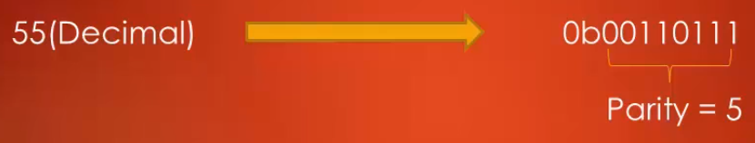

As shown in the above figure, 55 in binary form has 5 One's in it hence parity is 5. There are two options in parity, one is Even parity and another is Odd Parity.

#### Even Parity
* If Even parity option is selected, then if the number has an odd number of 1's in the binary form, the parity bit is made 0, so that total number of bits including the parity bit has an even number of 1's as shown below.

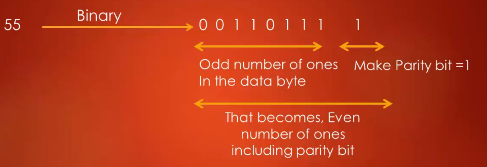

* If the number has an even number of 1's in the binary form, then the parity bit is made 0, so that total number of 1's in the number including parity bit is even as shown below. 

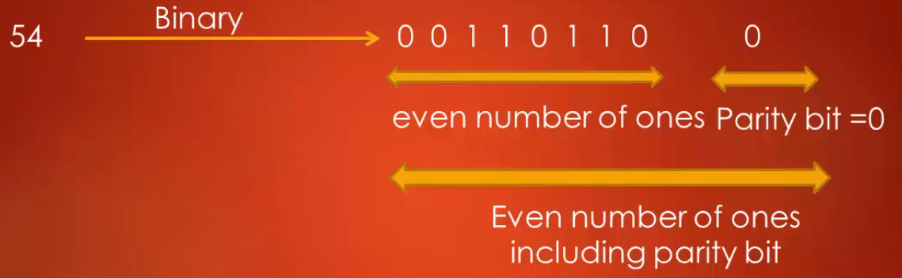

#### Odd Parity
* If odd parity option is selected, then if the number has even number of 1's in its binary form, then the  parity bit is made 1 so that total number of bits including  parity bit becomes odd as shown below

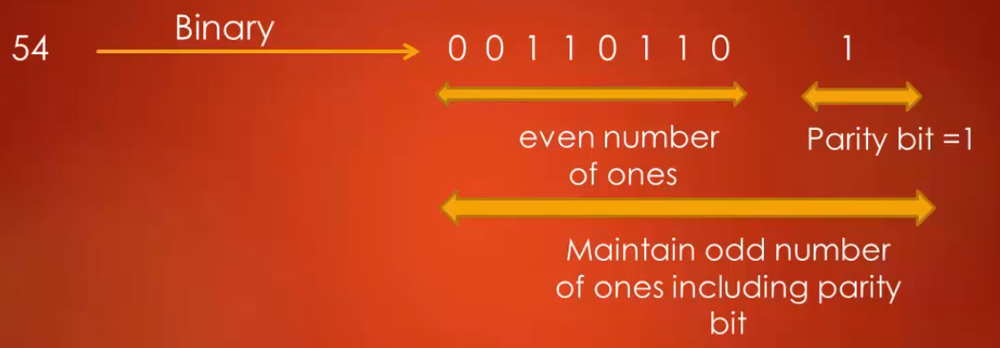

* If the number has an odd number of 1's in its binary form, then the parity bit is made 0 so that the total number of 1's including parity bit is odd as shown below.

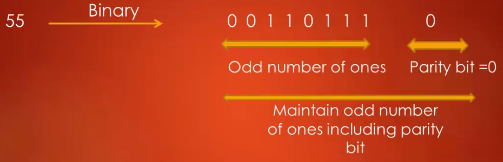

## USART Functional Block Diagram
**Refer : Figure 296. USART block diagram (Page 968 of RM0090)** 

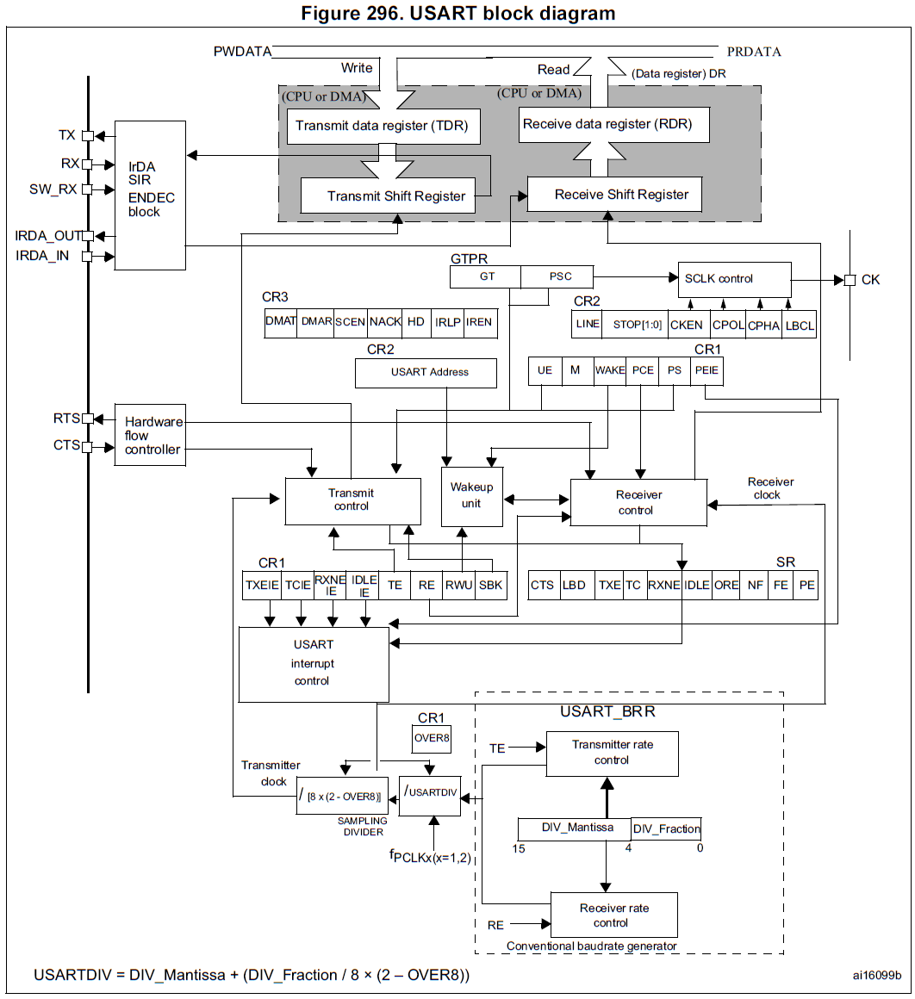

This hardware block can be used for both **synchronous** and **asynchronous** modes. The 4 important pins which are used in UART communication are TX, RX, RTS, and CTS. If this hardware block is used in synchronous mode then serial clock **CK** is used. The UART is full-duplex hence we can transmit and receive simultaneously.  For TX and RX functionality there are two data registers- **TDR Transmit data register)** and **RDR(receive data register)**. Each data register has its associated shift register. A couple of Control registers used to control the TX and RX block. At the bottom section of the figure, we can see the baud-rate generator. USART_BRR register must be configured with correct DIV_Mantissa and DIV_Fraction to produce the desired baud rate.

### UART Peripheral Clock
Referring [STM32F407VGT Block Diagram](https://github.com/SharathN25/STM32F407-Discovery#overview-of-stm32f407vgt6-microcontroller),
we can see that **USART1** and **USART6** are connected to **APB2(Max 84Mhz)** Bus, ideally these two peripheral should be able to run at 84Mhz, but when the microcontroller is powered by internally RC oscillator of 16Mhz, maximum peripheral clock that the USART hardware get is 16Mhz as shown below.

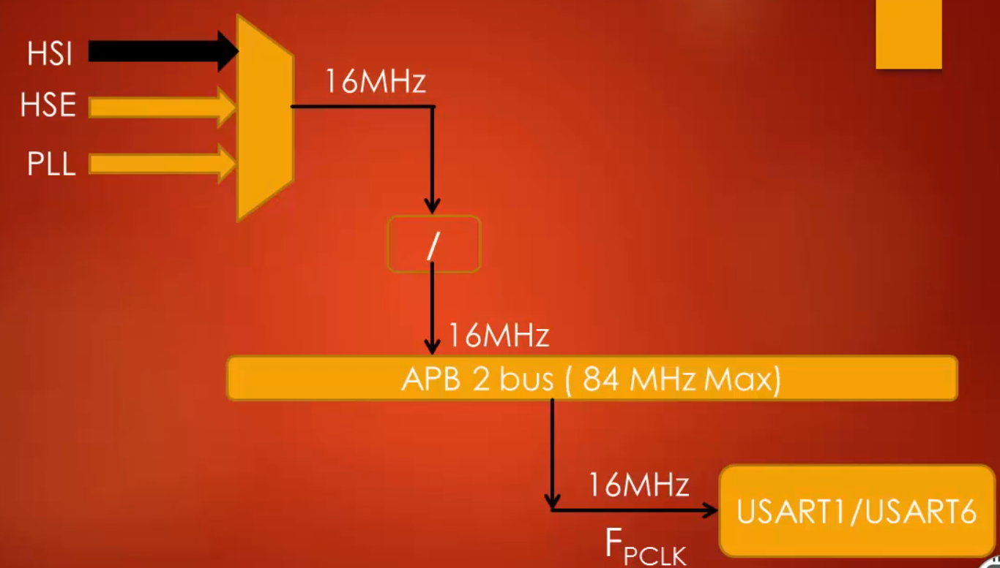

The **USART2**, **USART3**, **UART4** and **UART5** are connected to **APB1(Max 42Mhz)** Bus. This peripheral clock frequency is used by the UART baud-rate generation block to produce different baud-rates.
 
 
### UART Transmitter
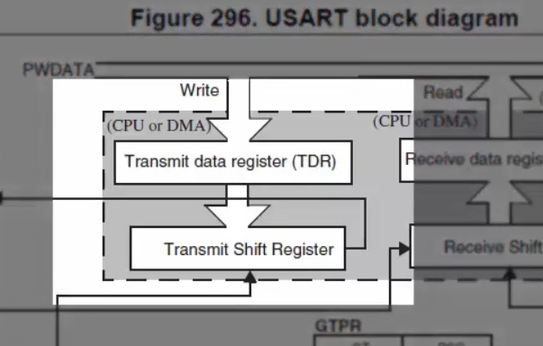

The Heart of the transmitter is **Transmit Shift register**, where parallel data is converted into serial data. Transmit shift register obtain data from *TDR*,  TDR is loaded with data by the software. Data is not loaded into that Transmit shift register until a stop bit is transmitted from the previous load. As soon as the last bit is transmitted the new data is loaded into shift register from TDR.

#### Steps to set up UART Data Transmission
1. Program the M bit in the USART_CR1 register to define the word length. There are options for 9bit or 8bit.
2. Program the number of STOP bits in the USART_CR2 register.
3. Select the desired baud rate using the USART_BRR register. Before baud rate selection you have to see **Table 134. Error calculation for programmed baud rates at fPCLK = 8 MHz or fPCLK = 12 MHz, oversampling by 16(1) (page 980 of RM0090)** and you must know your peripheral clock frequency because peripheral frequency puts a limit on the baud rate which you can generate.
4.  Set the TE bit in the USART_CR1 to enable the Transmit block.
5. Now enable the USART by writing the UE bit in USART_CR1 register to 1.
6. If the TXE flag is set, then write data bytes to send the USART_DR register. Repeat this for each data to be transmitted.
7. After writing the last data into the USART_DR register, wait until TC=1. This indicates that the transmission of the last frame is complete.

**Note:** After transmission if software wants to disable USART then it has to be done after TC=1.(TC stands for Transmission Complete).

### UART Receiver
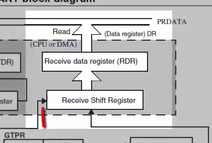

The heart of the Receiver is the **Receive shift register**, where the serial data is converted into parallel data. After sampling the RX pin for the stop bit, received data bits in the shift register are transferred to the **RDR**.

#### Steps to set up UART Data Reception
1. Program the M bit in the USART_CR1 register to define the word length. Both transmitter and receiver must agree on the word length.
2. Program the number of STOP bits in the USART_CR2 register.
3. Select the desired baud rate using the USART_BRR register. Baud rate must be the same for both UART Transmitter and UART Reciever. 
4. Enable the USART by writing the UE bit in the USART_CR1 register to 1.
5. Set the RE bit in the USART_CR1 to enable the Receive block.
6. Once the receiver block is enabled it starts searching for a start bit. When a character is received wait until the RXNE flag is set, then read the RDR.
7. RXNE flag must be cleared by reading the data register, before the end of reception of the next character to avoid an overrun error.

## USART Interrupts
**Refer to Figure 320. USART interrupt mapping diagram (page 1006 of RM0090)**

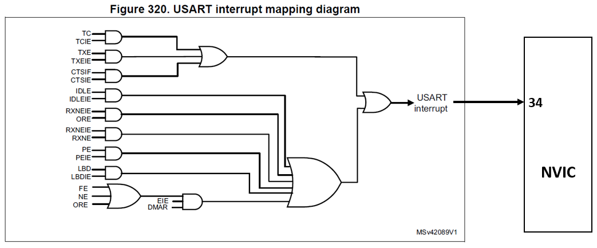

From the figure, we can see that only one line is going to NVIC of the processor. All the different events of USART will trigger an interrupt on this line. IRQ number of this line is 34, which means on 34th position or line number of NVIC the UART interrupt line is connected. The **Table 147** gives various  USART interrupts as shown below.

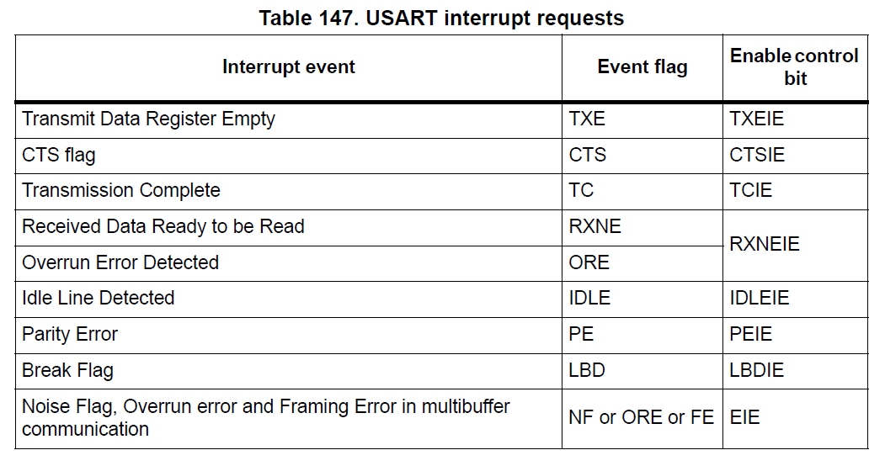

## USART Registers
**Refer: Section 30.6 USART Registers (Page 1007 of RM0090)**.

### 1. Control register 1 (USART_CR1)
* **TE(Transmitter enable)** and **RE(Receiver enable)** field are used to enable TX block and RX block respectively.
* **IDLEIE** - IDLE interrupt enable, **RXNEIE** - RXNE interrupt enable, **TCIE** - Transmission complete interrupt enable and **TXEIE** - TXE interrupt enable.
* **PEIE(PE interrupt enable)** - During transmission, if parity error occurs and parity flag is set, in this case, if PEIE is enabled then parity interrupt occurs.
* **PS(Parity selection)** - This bit selects the odd or even parity when the parity generation/detection is enabled (PCE set). So this PS bit is valid only when **PCE** bit enabled.
* **M**: Word length, **UE**: USART enable
* **OVER8**: Oversampling mode - oversampling is used by the receiver engine to sample RX.

### 2. Control register 2 (USART_CR2)
This register is used to control the synchronous mode of USART communication.

### 3. Control register 3 (USART_CR3)   
Used to configure **CTS** and **RTS** and error interrupts. It is also used to set peripheral DMA. The bit **EIE(Error interrupt enable)** - used to enable error interrupts such as frame error, 
noise error, overrun error, etc.

### 4. Data register (USART_DR)
As the USART is a full duplex, there are two data registers. The **TDR **provides a parallel interface between the **internal bus** and **output shift register**, **RDR** provides a parallel interface between the **internal bus** and **input shift register**. TDR and RDR are not directly accessible by software, but they are accessible by  **Data register (USART_DR)**.

**Behind the Scene working of Data Register**

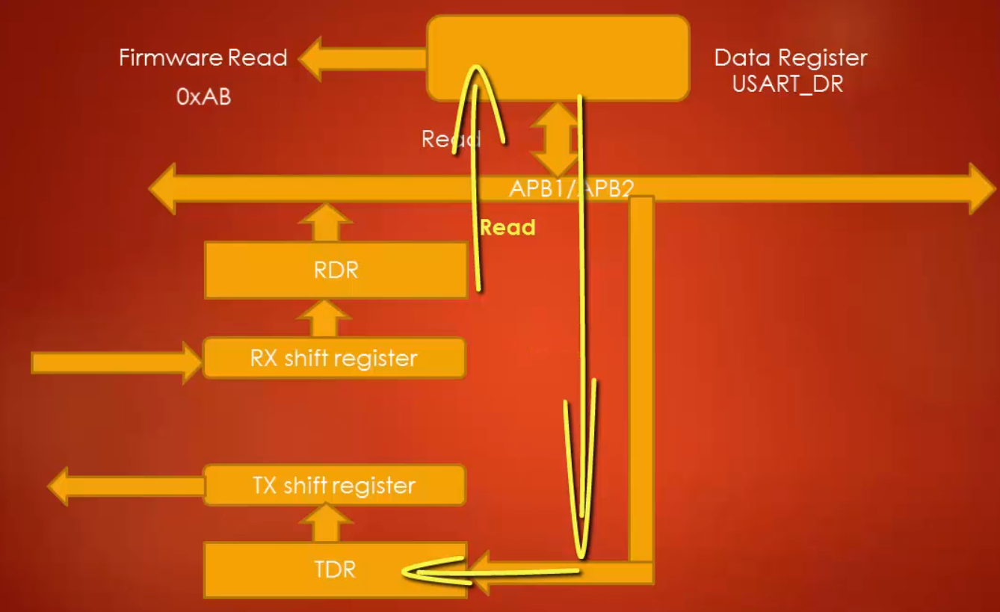

You can think of **USART_DR** as a window to peek into the **TDR**and **RDR**. The above figure shows how data register works.  A write to a Data register always loads the data into the TDR register and a read from the Data Register always returns the value of the RDR register.

### 5. Status register (USART_SR)
As you know status register is used to hold the various flags during the data communication. The UART peripheral has only one status register in which only 9-bits are used and rest are reserved. 
* **PE(Parity Error)**- This bit is set when a parity error occurs in receiver mode. This bit also triggers interrupts if PEIE is enabled in CR1.
* **FE:(Framing Error)** - This bit is set by hardware when a de-synchronization, excessive noise or a break character is detected.     
* **NF:(Noise detected flag )**- This bit is set by hardware when noise is detected on a received frame.
* **ORE: Overrun error**
* **IDLE: IDLE line detected**
* **RXNE:(Read data register not empty)** - This bit is set by hardware when the content of the RDR shift register has been transferred to the 
USART_DR register. So Firmware has to wait until this bit is set to read the DR. 
* **TC(Transmission complete)** - firmware has to wait until TC =1 to disable UART after the transmission is completed. 
* **TXE(Transmit data register empty)**- Set when TDR is empty. It is cleared by a write to the USART_DR register.

### 6. Baud rate register (USART_BRR)
To generate a proper baud-rate you have to configure this register. The Proper value should be set for DIV_Mantissa[11:0] and DIV_Fraction[3:0]. The value of the USART_BRR register is called **USARTDIV**. 

You can find all the information related to how to calculate DIV_Mantissa[11:0] and DIV_Fraction[3:0] in the Section **30.3.4 Fractional baud rate generation (Page 978 of RM0090)**
